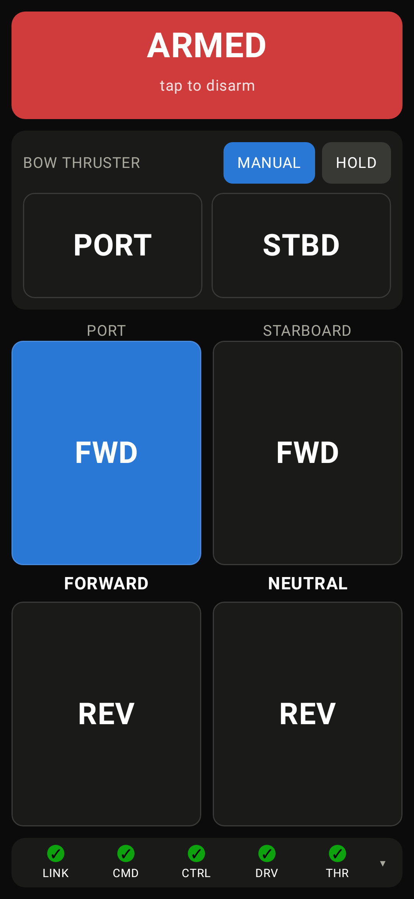
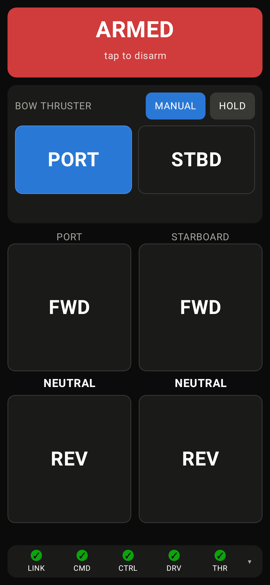
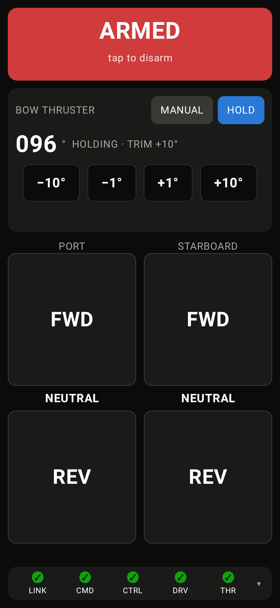

# Android command station

A **native** Android command station for the
[Drive Remote Controller](../README.md) — a fourth station alongside the
handheld TX remote and the browser UI, commanding the same two machines under
the same rules.

Not a WebView wrapper and not a PWA: it discovers or is pointed at any Signal K
server (adjustable host/port, mDNS search), and authenticates with a **token
obtained through the Signal K access-request flow** — the same mechanism TX, RX
and HH use through SensESP's `SKWSClient`.

## Screenshots

Captured on the reference device — a Galaxy S25 (SM-S931B, 1080×2340, density
480) — driving the **real boat server**, with RX and HH both answering. Not
mockups and not an emulator.

| Disarmed, as the app opens | Armed, port FWD held |
|---|---|
|  |  |

| Bow thruster — MANUAL, PORT held | Bow thruster — HOLD with trim |
|---|---|
|  |  |


That last screenshot records the pre-fix layout defect. The kill switch, the
thruster contacts and the drive bank are now all fixed, and **only the
telemetry panel scrolls** — so expanding telemetry cannot collapse live
buttons. Nothing that can command a machine sits inside a scrolling gesture
region: a momentary contact claims the pointer on touch down, so a drag that
begins on one is a press, and a scrolling ancestor would hand the operator a
scroll *and* a live command for the length of the drag.

The two-handed manoeuvre — port FWD and starboard REV held by two fingers at
once, which is the whole reason `ui/Momentary.kt` exists — is **not pictured**.
`adb`'s `input motionevent` injects a single pointer, so it cannot demonstrate
multi-touch; that shot has to be taken by a human with two fingers on the glass,
and it is a checklist item in
[SAFETY.md](../docs/SAFETY.md#before-trusting-the-android-station) rather than
something a script can claim.

## Why this can be a thin app

Everything safety-critical is server-side in
[`arbiter.cjs`](../sk-plugin/arbiter.cjs) — the exclusive arm token, universal
disarm, edge-triggered requests, stale eviction, fail-to-safe. This app is a new
*client* of that authority, not a new authority. Its whole contract with the
boat is two things:

- **read** — one WebSocket to `/signalk/v1/stream`, one subscribe message,
  17 paths
- **write** — `POST /plugins/signalk-drive-remote-controller/intent`, a flat
  JSON object, on change plus a 250 ms heartbeat

Like the browser UI, it **never writes a Signal K path**.

Notably it does *not* act as a TX-like station writing deltas directly. That
would bypass the arbiter entirely — no exclusive arm, no universal disarm, no
cross-station stale eviction — and two stations writing the same `plugin.*`
paths would reproduce the oscillating merged-value bug the arbiter exists to
prevent. See [ARCHITECTURE.md §10](../docs/ARCHITECTURE.md).

## Module split

The same split as the rest of the project, for the same reason:

| Module | What | Analogue |
|---|---|---|
| `core/` | Pure Kotlin. No Android imports, no clock reads, no I/O. Everything that **decides** something. | `esp32/lib/control_core/` (firmware), `arbiter.cjs` (plugin) |
| `app/` | Compose UI, `NsdManager`, OkHttp, lifecycle. Reads inputs, calls the core, writes outputs. | `esp32/src/` (firmware), `index.cjs` (plugin) |

`AGENTS.md`'s rule is that anything making a decision lives in the pure,
host-tested layer. That is what lets the safety logic below be tested on a
laptop with no Android SDK and no boat — exactly as `pio test -e native` runs
the firmware core with no ESP32 attached.

### What lives in `core/`

| File | Ported from | Decides |
|---|---|---|
| `DriveCommand.kt` | `pure/driveCommand.ts` | the forward/reverse truth table; both pressed ⇒ NEUTRAL |
| `TrimOffset.kt` | `pure/trimOffset.ts` | the relative, clamped heading-trim accumulator |
| `Liveness.kt` | `pure/rxLiveness.ts` | whether a unit is present — on **arrival**, never on a value |
| `Sources.kt` | `pure/sources.ts` | fixed precedence local > TX > plugin |
| `ControlState.kt` | `App.tsx` | armed state from `activeClient`; per-machine commandability |
| `ClientIntent.kt` | `clientIntent.ts` | the intent wire format |
| `SkDelta.kt` | `skClient.ts` | inbound delta parsing; the subscribe message |
| `SkValueStore.kt` | `skClient.ts` | last-known values **and when each last arrived** |
| `ReconnectBackoff.kt` | `skClient.ts` | capped exponential reconnect |
| `AccessRequest.kt` | *(new)* | the token flow; no browser equivalent exists |
| `ServerAddress.kt` | *(new)* | host/port → URLs; the browser reads `window.location` instead |
| `PrivateAddress.kt` | *(new)* | may this host be talked to in the clear; Android's network config cannot express it |
| `TokenHealth.kt` | *(new)* | when repeated 401s mean a dead token rather than the auth-scheme probe |
| `SkContract.kt` | `src/config.ts` | the paths and timings |

`pure/writeAccess.ts` is deliberately **not** ported: its job — detecting
silently dropped delta writes on a secured server — is replaced by explicit
token state, which is a better signal than inferring it.

## Building and testing

### What you need

| | For `:core:test` | For `:app` |
|---|---|---|
| JDK 17+ | **required** | **required** |
| Android SDK | not needed | **required** |

Verified with Temurin **21.0.11**, Android SDK **platform-35** and
**build-tools 35.0.0**. The Gradle wrapper downloads Gradle 8.14.3 itself on
first run — do not install Gradle separately.

`:core` is plain Kotlin/JVM, so **a JDK alone is enough to run the entire
safety suite.** That is deliberate: the pure logic must be testable on any
laptop, exactly as `pio test -e native` runs the firmware core with no ESP32
attached. Only build `:app` if you actually need the APK.

### One-time setup — Windows (PowerShell)

```powershell
# 1. JDK 21. The --custom part is what sets JAVA_HOME and PATH.
winget install --id EclipseAdoptium.Temurin.21.JDK -e `
  --accept-package-agreements --accept-source-agreements `
  --custom 'ADDLOCAL=FeatureMain,FeatureEnvironment,FeatureJarFileRunWith,FeatureJavaHome'

# 2. Android command-line tools, in the cmdline-tools\latest layout sdkmanager
#    requires. The path must contain no spaces.
$sdk = 'C:\Android\Sdk'
New-Item -ItemType Directory -Force "$sdk\cmdline-tools" | Out-Null
$zip = "$env:TEMP\cmdline-tools.zip"
Invoke-WebRequest -Uri 'https://dl.google.com/android/repository/commandlinetools-win-13114758_latest.zip' -OutFile $zip
Expand-Archive -Path $zip -DestinationPath "$sdk\cmdline-tools" -Force
Rename-Item "$sdk\cmdline-tools\cmdline-tools" "$sdk\cmdline-tools\latest"
Remove-Item $zip

# 3. Point the environment at it. Reopen PowerShell first if JAVA_HOME is blank.
[Environment]::SetEnvironmentVariable('ANDROID_HOME', $sdk, 'User')
$env:ANDROID_HOME = $sdk

# 4. The SDK packages compileSdk = 35 needs. --licenses prompts; answer y.
$sm = "$env:ANDROID_HOME\cmdline-tools\latest\bin\sdkmanager.bat"
& $sm --licenses
& $sm "platform-tools" "platforms;android-35" "build-tools;35.0.0"
```

Roughly 1.5 GB for the SDK, plus ~1.2 GB of Gradle distribution and
dependencies on the first build. AGP additionally fetches build-tools 34.0.0
by itself; that is expected, not a misconfiguration.

### One-time setup — Linux / macOS

Install a JDK (`brew install temurin@21`, or your distribution's
`openjdk-21-jdk`), then the same command-line tools from
`https://dl.google.com/android/repository/` — substitute `mac` or `linux` for
`win` in the archive name — unzipped to the same `cmdline-tools/latest`
layout. Export `ANDROID_HOME` and run the same two `sdkmanager` commands.

### Telling Gradle where the SDK is

Any one of these works; `settings.gradle.kts` checks all three:

- `ANDROID_HOME` environment variable
- `ANDROID_SDK_ROOT` environment variable
- `sdk.dir` in `android/local.properties`

`local.properties` is **gitignored** — it names a path that exists only on one
machine. Create it by hand if you prefer it to environment variables:

```properties
sdk.dir=C\:\\Android\\Sdk
```

Note that a change made with `setx` or `SetEnvironmentVariable` is only visible
to **newly launched** processes. An editor or terminal that was already open
when you set it will not see it.

### Build and test

```bash
./gradlew :core:test              # pure logic -- works with no Android SDK
./gradlew :app:testDebugUnitTest  # the layout floors, measured (needs an SDK)
./gradlew :app:assembleDebug      # -> app/build/outputs/apk/debug/app-debug.apk
```

On Windows use `.\gradlew.bat`. `:core:test` prints its own total
(`core: 171 tests, 171 passed, 0 failed, 0 skipped`) so a run can be quoted in
the journal the same way `pio test` and `npm test` are. Gradle caches an
unchanged suite; add `--rerun-tasks` when you want the count printed again.

### Installing the APK

```bash
adb install -r app/build/outputs/apk/debug/app-debug.apk
```

`adb` is in `$ANDROID_HOME/platform-tools`. Or copy the `.apk` to the phone and
tap it, allowing installation from unknown sources.

The debug APK is signed with the generic Android debug key from
`~/.android/debug.keystore`, which is generated per machine. It installs fine
for testing, but a build signed with a different key — including a future
release build — will not install over it; uninstall first.

### Running on the emulator

```bash
$ANDROID_HOME/cmdline-tools/latest/bin/sdkmanager "system-images;android-35;google_apis;x86_64"
$ANDROID_HOME/cmdline-tools/latest/bin/avdmanager create avd -n drive35 \
  -k "system-images;android-35;google_apis;x86_64"
$ANDROID_HOME/emulator/emulator -avd drive35
```

Two things behave differently there:

- **The server address.** The emulator's own loopback is not the host's. A
  Signal K server running on your development machine is reached at
  **`10.0.2.2`**, which the cleartext gate below allows by name. A server
  elsewhere on the LAN is reached at its ordinary address, also allowed.
- **mDNS discovery does not work.** The emulator's NAT does not forward
  multicast, so the setup screen sits on *Searching the network…* forever. Type
  the host and port into the address field instead — a typed address and a
  tapped discovery result go through the same `useServer()` path and get the
  same checks.

### Making your own version

Two things identify the app, both in [`app/build.gradle.kts`](app/build.gradle.kts):

| | |
|---|---|
| `applicationId` | `io.github.kegustafsson.driveremote` — the package the phone installs under. Change it and your build installs *alongside* the original rather than over it, which is what you want while comparing two versions. |
| `namespace` | the Kotlin package root. Changing it means moving the source directories to match; changing only `applicationId` does not. |

`minSdk = 30` (Android 11). Two consequences worth knowing. It does **not**
silence the `NsdManager.resolveService` deprecation — the replacement is API 34,
so the deprecated call still serves Android 11, 12 and 13 — and it roughly
doubles the `.apk` file, because from minSdk 28 AGP stores `classes.dex`
uncompressed for memory-mapping. Measured, same commit, only minSdk differing:
1,905,507 → 4,100,963 bytes, while the dex itself got 57,748 bytes *smaller*.
Installed size is unchanged and startup is faster; only the published file grows.

It was `minSdk = 26` before, chosen because NsdManager's discovery callbacks are
materially less reliable below that. `targetSdk`/`compileSdk = 35`.

**The version comes from git**, not from a hand-edited number: `versionCode` is
the commit count, which is monotonic on `main`, and `versionName` is
`0.<commit count>`. Still below 1.0 deliberately, because SAFETY.md's
commissioning checklists have not been worked through.
`./gradlew :app:printVersion` prints it.

### Release builds

Two outcomes, decided entirely by whether the build was given a key:

| | Output | Installable? |
|---|---|---|
| No key | `app/build/outputs/apk/release/app-release-unsigned.apk` | **No.** Android refuses an unsigned APK |
| Key supplied | `app/build/outputs/apk/release/app-release.apk` | Yes |

The build prints one line saying which case it is in, so nobody reads
*BUILD SUCCESSFUL* as *signed*. Check for it before believing an APK:

```text
Release signing: UNSIGNED (no release keystore; see docs/BUILDING.md section 6)
Release signing: release key /home/you/.driveremote/driveremote.keystore
```

The unsigned build is the expected default, not a misconfiguration — the signing
key is not in this repository, so a build that was not given one has nothing to
sign with. It is still useful: it compiles the release variant and produces the
SBOM, which is most of what a release run does.

#### Step 1 — check the prerequisites

```bash
./gradlew :app:printVersion       # needs :app, so needs an SDK
git rev-parse --is-shallow-repository   # must print false
```

A **shallow clone is refused** for a signed build. `versionCode` is the commit
count, so a shallow clone would produce a lower number than an existing release
and the phone would refuse it as a downgrade. `git fetch --unshallow` fixes it.
The unsigned path does not check, because nothing will install the result anyway.

#### Step 2 — get a key (once, ever)

Skip this if you already have one. **A new key is not a free do-over:** Android
will not replace a build signed with one key by a build signed with another, so
every phone must uninstall and reinstall — which clears the stored Signal K token
and needs a fresh access request approved on the server.

```bash
keytool -genkeypair -v \
  -keystore ~/.driveremote/driveremote.keystore \
  -storetype PKCS12 \
  -alias driveremote \
  -keyalg RSA -keysize 4096 \
  -validity 10000
```

`keytool` ships with the JDK. With PKCS12 the store password is used again as
the key password. `driveremote` is the alias the build assumes when
`DRIVEREMOTE_KEY_ALIAS` is unset. 10000 days is about 27 years — a signing key
should outlive the phones.

**Back the file up somewhere that is not this machine, and keep it outside the
repository.** `android/.gitignore` refuses `*.keystore`, `*.jks` and
`keystore.properties`, but the safe habit is that the key is never under the
repository at all.

#### Step 3 — put the key in the environment

Read from the environment and nowhere else, so there is no properties file to
commit by accident:

| Variable | What it is | Default |
|---|---|---|
| `DRIVEREMOTE_KEYSTORE` | Path to the keystore | `app/release.keystore` |
| `DRIVEREMOTE_KEYSTORE_PASSWORD` | Store password | none — no password, no signing |
| `DRIVEREMOTE_KEY_ALIAS` | Alias inside the store | `driveremote` |
| `DRIVEREMOTE_KEY_PASSWORD` | The key's own password | the store password |

Set them for the shell you are about to build in, not in a startup file:

```bash
# Git Bash, macOS, Linux -- `read -s` keeps the password out of shell history
export DRIVEREMOTE_KEYSTORE="$HOME/.driveremote/driveremote.keystore"
read -s -p "keystore password: " DRIVEREMOTE_KEYSTORE_PASSWORD; echo
export DRIVEREMOTE_KEYSTORE_PASSWORD
```

```powershell
# PowerShell
$env:DRIVEREMOTE_KEYSTORE = "$env:USERPROFILE\.driveremote\driveremote.keystore"
$env:DRIVEREMOTE_KEYSTORE_PASSWORD = (Get-Credential -UserName driveremote `
  -Message "keystore password").GetNetworkCredential().Password
```

**A keystore named but unusable stops the build** — if `DRIVEREMOTE_KEYSTORE`
points at nothing, or its password is empty, Gradle fails with the reason. A typo
would otherwise produce an unsigned APK without a word. Note also that CI injects
an *unset* secret as an empty string rather than leaving it unset, which is why
the alias and key password use `takeUnless { isNullOrEmpty() }` rather than `?:`.

#### Step 4 — build

```bash
./gradlew :app:assembleRelease
```

Run the layout floors too if anything in `app/` changed — geometry is a safety
property on the control screen:

```bash
./gradlew :app:testDebugUnitTest :app:assembleRelease
```

#### Step 5 — verify it is actually signed, by the key you meant

`BUILD SUCCESSFUL` proves neither. Two independent checks:

```bash
ls app/build/outputs/apk/release/     # app-release.apk, no "-unsigned"

# apksigner is in $ANDROID_HOME/build-tools/35.0.0/ (apksigner.bat on Windows)
apksigner verify --print-certs app/build/outputs/apk/release/app-release.apk
```

Compare the printed SHA-256 against the key you expect. Straight from the
keystore, converted into the lowercase-no-colons form the release workflow's
`DRIVEREMOTE_CERT_SHA256` variable uses:

```bash
keytool -list -v -keystore ~/.driveremote/driveremote.keystore -alias driveremote \
  | grep -i "SHA256:" | head -1 | sed 's/.*SHA256: *//' | tr -d ':' | tr 'A-F' 'a-f'
```

#### Step 6 — install

```bash
adb install -r app/build/outputs/apk/release/app-release.apk
```

Moving **between** debug and release means uninstalling first, in either
direction — the keys differ:

```bash
adb uninstall io.github.kegustafsson.driveremote
```

**That uninstall clears the stored Signal K token.** It lives in app-private
storage excluded from backup, so the station needs a fresh access request
approved in the server's admin UI afterwards.

#### What the release build does not change

- **The cleartext gate.** `PrivateAddress.isPrivateHost()` is in `:core` and
  applies identically to both variants.
- **Logging.** Nothing strips log statements from the release build.
- **The code itself.** R8 shrinks and obfuscates the release build — see below.

The signed APK on a GitHub Release comes from the workflow, not from a laptop;
that pipeline, the CI secrets and the fingerprint gate are in
[docs/BUILDING.md §6 and §10](../docs/BUILDING.md#6-the-android-station).

### R8

**On since 2026-09-10**, and it was off before that. `buildTypes.release` sets
`isMinifyEnabled = true` and `isShrinkResources = true`, with the keep rules in
[`app/proguard-rules.pro`](app/proguard-rules.pro).

| | Unshrunk | With R8 |
|---|---|---|
| `app-release.apk` | 8,239,654 B | **2,470,571 B** — 70% smaller |
| Classes removed (`usage.txt`) | — | ~48,000 lines |
| Kept (`seeds.txt`) | — | **863 entries** |
| `mapping.txt` | — | ~30 MB |

**What changed the decision.** The objection to R8 here was never the tooling, it
was that shrinking an *unverified* codebase adds a failure mode that appears only
in the release build, on a boat, in an app that commands a clutch and a thruster
contactor. That objection was answered by testing rather than by argument: the
shrunk APK was fresh-installed on a phone, granted a **new Signal K access
request**, armed against the live server, and used to command a drive and the
thruster. That path is exactly the one at risk — see the Tink note below.

#### The build change, if you are reconstructing it

```kotlin
// app/build.gradle.kts
buildTypes {
  release {
    isMinifyEnabled = true
    isShrinkResources = true          // requires isMinifyEnabled
    proguardFiles(
      getDefaultProguardFile("proguard-android-optimize.txt"),
      "proguard-rules.pro",
    )
    if (hasReleaseKey) signingConfig = signingConfigs.getByName("release")
  }
}
```

`proguard-android-optimize.txt` comes from the SDK. **`app/proguard-rules.pro`
must exist** — a config that names a rules file which is not there builds far
enough to fail inside R8, and the "does not exist" line is only a warning several
screens above the actual error.

#### What actually needs keep rules here

Most of it is already handled, and it is worth knowing which parts so you only
debug the ones that are not:

**There are no hand-written keep rules any more.** `app/proguard-rules.pro` is
effectively empty, and that is the end state rather than an omission: every
dependency below ships its own consumer rules. The one exception used to be Tink,
reached only through `androidx.security-crypto`, whose only caller was the
one-time token-store migration — file, dependency and rules were deleted
together once every station had migrated. Removing them took the APK from
4,109,155 to 2,470,571 bytes and dropped R8's retained set from 21,562 entries to
863, because 20,682 of those were Tink held by a single blunt keep.

Checked by unzipping the artifacts in the Gradle cache, not assumed:

| Dependency | Ships its own R8 rules? | What you may still need |
|---|---|---|
| Compose, AGP, AndroidX | Yes, as consumer rules in the AARs | Nothing normally |
| OkHttp 4.12 | Yes — `META-INF/proguard/okhttp3.pro` | The Conscrypt / BouncyCastle / OpenJSSE `-dontwarn` lines, if the build warns |
| kotlinx.serialization 1.7.3 | Yes — in `kotlinx-serialization-core`, including an R8-specific `kotlinx-serialization-r8.pro` | Nothing for compiler-generated serializers, which is all of `:core`'s |
| `NsdManager`, `DataStore` | n/a — framework, no reflection | Nothing |
| `KeystoreEncryptedPreferences` | n/a — platform AES-GCM, reflects on nothing | Nothing |

**There is nothing left to keep by hand.** `app/proguard-rules.pro` carries no
rules at all, only the note explaining why.

Tink used to be the exception, and an expensive one. It reached this build solely
through `androidx.security-crypto`, whose only caller was
`LegacySecureStoreMigration` — the one-time move of the token store off that
library. Protecting it took a blunt `-keep class com.google.crypto.tink.** { *; }`,
because narrowing it risked stripping a key manager and breaking the stored token
in the release build only, where nothing here would have caught it.

Once every station had migrated, the file, the dependency and the rules were
deleted together. Measured, same tree, only that change:

| | With the migration | Without |
|---|---|---|
| `app-release.apk` | 4,109,155 B | **2,470,571 B** |
| R8 retained (`seeds.txt`) | 21,562 entries | **863** |
| Deprecation warnings | 9 | **0** |

20,682 of those 21,562 entries were Tink — 96% of everything the shrinker had
been forbidden to touch. That is what a single defensive keep rule costs when the
library behind it reflects on its own registry.

Add rules here only in response to an observed failure: a keep rule written on a
guess silently defeats the shrinking you turned on, and nothing reports that.

#### The part that is easy to miss

**`:app:testDebugUnitTest` tests the *debug* variant.** Robolectric lays out the
real Compose tree, but against unminified debug classes — so the layout-floor
suite, which is the thing standing between an operator and a 4.7 dp STOP button,
**does not see the shrunk build at all**. This is the one objection to R8 that
the hardware test did not answer, and it is still open: a control-layout change
needs that suite *and* a look at the shrunk APK on glass.

The options, cheapest first:

1. `testBuildType = "release"` in the `android { }` block, so `./gradlew
   :app:testReleaseUnitTest` runs the same suite against the release variant.
   Note unit tests run on the JVM against pre-minified classes even then — this
   changes the variant, not whether R8 has run.
2. An instrumented test run (`connectedAndroidTest`) against the minified APK on
   a device or emulator. This is the only one that exercises the actual shrunk
   code, and there is no `androidTest` source set here yet.
3. At minimum, install the minified APK and walk SAFETY.md's Android checklist by
   hand before it goes near machinery.

#### Verifying a shrunk build

```bash
./gradlew :app:assembleRelease
# what R8 removed, kept, and why
cat app/build/outputs/mapping/release/usage.txt
cat app/build/outputs/mapping/release/seeds.txt
# keep this: it is what makes a release stack trace readable
ls app/build/outputs/mapping/release/mapping.txt
```

`mapping.txt` is the deobfuscation map for that exact build, and it measured
**30 MB** here. Without the one matching the APK a crash report from the boat is
unreadable, so it has to be archived alongside the APK — the release workflow
does not currently do that, which is one more thing to add before enabling this.

No formatter or linter is configured (no ktfmt, spotless or detekt). The
existing source is 2-space indented, 100 columns; match it by eye.

### Why `:app` disappears without an SDK

`:app` is included in the build **only when an Android SDK is present**. Gradle
configures every included project even for a `:core`-only build, so an
unconditional include would put the pure safety suite behind a toolchain it does
not use. Asking for an `:app` task without an SDK fails with a message saying
so, rather than a stack trace.

`build.gradle.kts` at the root declares every plugin `apply false`, **including
AGP**, and the long comment there explains why each of the tempting
alternatives fails. Do not move those declarations back into the modules.

## The path contract is hand-synced three ways

`core/SkContract.kt` mirrors `sk-plugin/src/config.ts`, which mirrors
`esp32/include/config.h`. There is no shared build step between the PlatformIO, npm
and Gradle projects, so **a change to a path or a timing constant must be
applied to all three.** Constants are cross-referenced by name so a diff is
obvious.

The same applies to the safety logic itself: `fromSwitch`, the trim clamp and
the liveness rule now exist in C++, TypeScript **and** Kotlin. That duplication
is the real cost of a native app, and the mitigation is that every vector test
was ported alongside the code — `DriveCommandTest` mirrors
`driveCommand.test.ts` mirrors `test_drive_command.cpp`. The tables are the only
thing that will catch the three drifting apart.

### What lives in `app/`

| File | Responsibility |
|---|---|
| `net/SkStream.kt` | OkHttp WebSocket, auth header on the upgrade, reconnect |
| `net/IntentPoster.kt` | the intent POST, independent of the stream |
| `auth/AccessRequestClient.kt` | HTTP for the token flow; all parsing is in `core` |
| `discovery/MdnsDiscovery.kt` | `NsdManager` browse for `_signalk-http._tcp` |
| `settings/SettingsStore.kt` | server in DataStore, token in `KeystoreEncryptedPreferences` |
| `settings/KeystoreEncryptedPreferences.kt` | AES-256-GCM under an Android Keystore key; a `SharedPreferences` so the call sites did not change |
| `StationViewModel.kt` | command state, the 250 ms heartbeat, the staleness ticker |
| `ui/Momentary.kt` | the per-pointer momentary button — the multi-touch primitive |
| `ui/HelmScale.kt` | the proportional scale, and the floors and ceilings it moves |
| `ui/ControlScreen.kt` | the control screen's arrangement, and its measurable geometry |
| `ui/Controls.kt`, `ui/StatusPanel.kt`, `ui/SetupScreen.kt` | the screens |

`ControlScreen` takes plain values and callbacks rather than the ViewModel, so
the layout can be rendered without a server, a token or a boat. That is what
makes the geometry below testable — and on this screen geometry is a safety
property, not a matter of taste.

**The one control that stays live while disarmed is the thruster's MANUAL/HOLD
chooser.** It commands nothing; it decides which gate the *next* arm opens, and
the operator picks that before arming rather than arming into whichever mode
happens to be showing. Everything that reaches the thruster — the PORT/STBD
contacts, the trim steps — stays inert on `view.thrusterCommandable` exactly as
before. Because arming with HOLD selected starts the hold with no further press,
the disarmed panel says so outright and labels the heading "CURRENT HEADING"
rather than claiming to hold it. `ui/ThrusterModeSelectionTest.kt` pins both
halves: the chips are pressable while disarmed, the commanding controls are
not.

### Scaling to the screen it is on

Resolution is not the variable. Compose cancels density out, so a 1080p and a
1440p phone of the same physical size render identical buttons. What differs is
the **window in dp** — 360×780 on the reference phone, 800×1280 on a 10" tablet,
360×390 in split-screen — and that is read from the actual constraints rather
than from the device, so a split-screen pane is sized as the small window it is.

Two mechanisms, both mirroring the browser UI so all three stations keep reading
as one system.

**A proportional scale**, `HelmScale`, which is the Kotlin twin of the web UI's
`--u` (`sk-plugin/src/index.css`): the same S25 reference, the same 1.45 upper
clamp, the same idea that a size written `30` means "30 dp on the reference
phone, scaled". It diverges in one place — the lower clamp is **1.0**, where the
browser's is 0.72. The web UI must fit inside desktop browser windows and so
shrinks; this app holds its floors and lets a control overflow visibly instead,
which is the failure the layout suite is built around. Scaling down would
quietly shrink those floors and defeat it.

**The leftover goes to the controls.** The 280 dp drive-bank reservation was
only ever half a rule: the bank was unweighted at its minimum while telemetry —
which commands nothing — held the `weight(1f)` and absorbed every spare pixel.
`ControlSurface` is a measure policy rather than a `Column` because the priority
wanted here cannot be said with weights: bank floor first, then telemetry's
natural height, then the bank up to its ceiling, then the remainder back to
telemetry. Telemetry is still what gives way on a short screen.

Measured, as `LayoutFloorsTest` renders them:

| window | scale | drive contact | was | thruster contact |
|---|---|---|---|---|
| reference phone 360×780 | 1.00 | **185 dp** | 88 dp | 88 dp |
| budget phone 360×640 | 1.00 | 115 dp | 88 dp | 88 dp |
| supported minimum 360×512 | 1.00 | 110 dp | 88 dp | 88 dp |
| split-screen 360×390 @1.5× | 1.00 | 97 dp | 88 dp | 88 dp |
| phone landscape 780×360 | 1.00 | 93 dp | — | 88 dp |
| 7" tablet 600×960 | 1.23 | 295 dp | 88 dp | 108 dp |
| 10" tablet 1280×800 | 1.03 | 229 dp | 88 dp | 90 dp |
| 10" tablet 800×1280 | 1.45 | **348 dp** | 88 dp | 128 dp |

The ceiling is the reason the tablet stops at 348 rather than filling 1280 dp of
height with one button: past a point a bigger target is just a longer reach, and
beyond it the contacts sit centred with the slack around them so FWD and REV stay
adjacent under one thumb.

**The arrangement follows the shape of the window, not its width.**

*Upright — a phone or a tablet in portrait — stacks:* kill switch across the
top, thruster block, the two drives side by side, telemetry under them. A tablet
held upright is the same shape as a phone held upright and wants the same
screen; on an 800 × 1280 dp tablet that is a full-width kill switch over 348 dp
drive contacts. Choosing on width alone used to put that tablet into the
landscape arrangement, where "BOW THRUSTER" came out one letter per line and the
fourth trim button fell off the side of a 250 dp middle column.

*On its side, with room to stack (≥ 600 × 500 dp), it becomes the browser UI's
wide layout:* the same stack in the main column, telemetry lifted out into a
300 dp sidebar down the right — the Compose twin of the `min-width: 860px` rule
in `sk-plugin/src/index.css`. Telemetry moves sideways rather than being
squeezed because a landscape window is short on height and long on width. On a
1280 × 800 dp tablet: a 950 dp main column with 229 dp drive contacts, and a
297 dp sidebar running the full height.

*Wide but too short to stack* — a phone on its side, a split-screen or freeform
pane — falls back to the **drives at the outside edges** with the thruster and
telemetry between them. Each drive column then carries nothing but its own two
contacts and runs the full height of the row, which is the only way 360 dp of
height fits them at all.

**Phones stay locked upright**; tablets rotate. **The manifest declares no
`screenOrientation` at all** — it is one value for every device and the answer
here depends on the device — so `MainActivity.lockOrientationForFormFactor()`
sets `SCREEN_ORIENTATION_PORTRAIT` below 600 dp and `SCREEN_ORIENTATION_USER`
at or above it, measured from the display rather than the window.

Locking a tablet upright does not keep it upright, it letterboxes: held in
landscape the app was drawn into a portrait-shaped pane with wallpaper down both
sides, so the bigger screen got the smaller control panel. It is also not a lock
that survives — from **targetSdk 36, Android 16 ignores `screenOrientation` on
any display of sw600dp or more**, and the opt-out property stops working at
targetSdk 37.

Three spellings were tried before this one, and each failed differently. Worth
knowing before someone simplifies it back:

- **A `values-sw600dp` resource on `android:screenOrientation`.** The attribute
  takes a resource reference and it resolves, but the manifest is read by the
  package manager, which resolves it without a device configuration — the
  qualified value is never consulted and the tablet keeps the lock.
- **`configuration.smallestScreenWidthDp` at runtime.** While an activity is
  letterboxed its Configuration describes the *pane*, not the display: about
  355 dp on a 1920 × 1200 tablet. The check would read "phone" in exactly the
  state that needs the tablet answer. `maximumWindowMetrics` is the display
  whatever shape the window has, and is what is used.
- **Keeping `screenOrientation="portrait"` as the *launch* value and unlocking
  in `onCreate`.** Correct in the end state and visibly wrong on the way there:
  the activity launched locked, so on a landscape tablet the window — splash
  included — was created letterboxed and then resized. A small black rectangle
  grew to fill the screen at every launch. Declaring nothing means the window is
  created at the size the device is already at.

Verified by instrumenting `onConfigurationChanged`: a cold start now reports the
full `1920 × 1200` in `onCreate` and **no resize at all**, in either
orientation. A deliberate rotation of the running app still produces exactly one
— handled without recreation, since `configChanges` covers
`orientation|screenSize`.

The cost is narrow and lands where it hurts least: a phone whose owner has
auto-rotate on and is holding it sideways at launch now comes up landscape for a
moment before snapping upright. A tablet in landscape was doing that on *every*
launch.

The setup and access screens scale too, but cap their content width and centre
it: a line of explanatory text 1280 dp wide is not using the screen well, just
hard to read.

## Connecting to a server, and losing the right to

### The cleartext gate

The app refuses to talk to a server over plain `http` unless it is on a private
network. `PrivateAddress.isPrivateHost()` covers RFC1918, `127/8`,
`169.254/16`, `.local`, single-label names, and IPv6 `::1`, `fc00::/7`,
`fe80::/10`; `ServerAddress.isCleartextSafe` is `useTls || isPrivateHost(host)`.
**Anything unrecognised returns false** — an address the parser does not
understand is refused rather than trusted — and the remedy is always `https://`,
which is allowed unconditionally.

This is a `:core` rule rather than a `res/xml/network_security_config.xml` one
because it *cannot* be expressed there: Android matches a `<domain>` entry by
**suffix**, which is right for DNS names and useless for IP addresses, whose
network part is a prefix. `192.168.0.100` does not end with `.192.168`. The
config has no CIDR syntax at all and the server's address is not known at build
time, so the XML is now a bare permissive `base-config` and the decision lives
in tested Kotlin.

It is enforced in `useServer()`, the one point both a typed address and a
tapped discovery result pass through, so a discovered service advertising a
public hostname is refused on the same terms as a typo. Nothing is stored and
no socket opens, so the token cannot leave. The text field greys out *Connect*
and explains why while you are still typing; that is the kinder telling, not
the gate.

### Token lifecycle

The token is bound to the server that issued it, so pointing the app at a
second server starts a fresh access request rather than carrying the first
server's credentials into a guaranteed 401. (A token stored before that binding
existed is treated as belonging to the configured server, so upgrading does not
force a re-authorisation.)

| Situation | What the app does |
|---|---|
| Server + valid token stored | straight to the controls |
| Stored token past its stated expiry | token dropped at startup, server screen, notice saying why |
| No server stored | server screen |
| Network drops, token still good | **stays on the controls**; the stream reconnects on backoff |
| Token revoked server-side | past the auth-scheme probe → session ends, server screen, notice |
| Token expires mid-session | pre-empted by the heartbeat, not waited for |
| Auth-scheme probe in progress | a note in the status panel, no teardown |
| Operator taps Disconnect | final all-neutral intent, then session ends |
| Disconnect **while armed** | refused — "Disarm before changing server" |

**A 401 does not mean the token is dead.** Both this app and the browser UI
probe `AuthScheme.TRY_ORDER` (`Bearer`, then `JWT`) because signalk-server has
historically accepted only one or the other, so every rejection before the right
scheme is the handshake working. `TokenHealth` counts *consecutive* rejections
and declares death only past `AuthScheme.TRY_ORDER.size + 1` — derived from the
list, not hard-coded, so adding a third scheme cannot silently make the probe
look like a dead token. One acceptance clears the count. At the 250 ms heartbeat
the verdict lands in 750 ms.

**A transport failure is never counted.** Losing the network is not losing
authority, and counting it would drop a good token every time the boat's WiFi
hiccuped. It also matters that the station stays on the control screen while
offline: its disarm has to keep working when it cannot see the boat.

**Starting up is not offline.** `LinkPhase` (in `:core`) is what the operator is
told about the link, as against `ConnectionState`, which is what the link is —
and they differ in exactly one place. A socket that has *never* opened this
session reads as `CONNECTING`, in the same calm grey as DISARMED, for up to
`SkContract.LINK_STARTUP_GRACE_MS`; after that, and from the instant a session
that *had* been open loses its stream, it is `OFFLINE` in amber. Every command
gate still reads `ConnectionState`, so nothing is loosened — this is only what
is said.

The reason for the distinction is that the old behaviour drew the full amber
OFFLINE panel on the STOP button at every single launch, for the few hundred
milliseconds the first WebSocket took to open. A warning that always fires is
one the operator stops reading. Saying it calmly is safe here and provably so:
arming requires liveness, liveness requires an open socket, and `changeServer`
refuses while armed — so no station can be armed or commanding before its first
open. `LinkPhaseTest` holds the rule, including that a drop mid-session gets no
grace at all.

**Teardown order is deliberate** — release all controls to neutral *while the
heartbeat and token are still live*, then stop the heartbeat, then close the
socket. The arbiter sees this station let go rather than merely fall silent.
Falling silent also works, since stale eviction is the backstop, but it costs a
timeout for nothing.

**Disconnect is refused while armed** rather than hidden. Disconnecting armed
would leave the station holding the arm token until stale eviction, with the
operator on a screen showing no controls: armed, still commanding, unable to see
or stop it. It also lives behind the telemetry toggle rather than on the main
surface — a control that ends the session should not sit where a thumb lands
during a manoeuvre.

## Status — read this before trusting anything here

`app/` has commanded both machines from a phone against the live boat server.
That is a real milestone and still a long way short of "it works".

| | |
|---|---|
| `core/` | **Verified.** 147 tests, `./gradlew :core:test`, no warnings. |
| `app/` | **Builds, and its layout floors are measured.** `./gradlew :app:assembleDebug` produces a debug APK (~11.2 MB); `:app:testDebugUnitTest` runs 6 Robolectric layout tests. Two `NsdManager` deprecation warnings. Everything in `app/` *except* that geometry — lifecycle, intent ordering, teardown — is still untested. |
| On a device | **Installed and run** on the owner's phone (2026-07-25). |
| Against a real server | **Connection path proven.** signalk-server 2.30.0: mDNS/manual address, access request approved, token issued, stream subscribed, intent POST accepted at **readwrite**. |
| Commanding a machine | **Yes, once (2026-07-26).** Armed with RX and HH both answering; port FORWARD commanded and released to NEUTRAL, thruster driven PORT in MANUAL, HOLD engaged and trimmed +10° off a real 096° heading, then disarmed. Hardware confirmed safe beforehand. |
| Multi-touch, backgrounding, revocation | **Never.** The presses above were injected one pointer at a time by `adb`, so nothing about two-fingered operation was demonstrated. |

The `readwrite` route permission this depends on
([ARCHITECTURE.md §10](../docs/ARCHITECTURE.md#10-the-plugin)) is **confirmed
present on signalk-server 2.30.0**, so a station on that server needs an
ordinary read/write access request, not an admin one. The feature-detected
admin fallback is not in play here. On an older server it may be — the
commissioning `curl` in §10 is how you find out.

What is proven is that a press here moves the right machine and that releasing
it returns to the safe value. What is **not** proven is everything that needs a
human hand or an adverse event: two fingers at once, backgrounding and screen
lock, exclusive arm against the browser UI, and a token withdrawn mid-session.
The safety-relevant decisions are all delegated to `core/`, which *is* tested;
the wiring between `core/` and the boat is now partly exercised, not verified.
Work through the checklist in
[SAFETY.md](../docs/SAFETY.md#before-trusting-the-android-station) before this
commands anything in earnest.

### Known gaps

- **The layout floors are measured on the JVM, but never yet on the reference
  phone.** `app/src/test/.../LayoutFloorsTest.kt` renders the real Compose tree
  under Robolectric — at the S25's 360×780 dp, at a 360×640 dp budget phone, at
  the 360×512 dp supported minimum, at a 360×390 dp split-screen window, at
  600×960, 800×1280 and 1280×800 dp tablets and at a 780×360 dp landscape
  window, at system font scales up to 2.0× — and asserts every live contact
  ≥ 88 dp, the drive bank ≥ 280 dp, the kill switch on screen and unmoved by
  scrolling, and **no live control anywhere beneath a scrolling ancestor**. It
  runs in CI, so an `app/` change no longer reaches the boat as the first
  compiler that has ever seen it.

  Since the scale went in it also asserts the opposite of a floor: that a
  contact on a screen with room to spare is **not** sitting at 88 dp, because
  that would mean the leftover space went back to the panel that commands
  nothing. Floors alone were passing while the tablet layout was wrong.

  Its regression value was checked rather than assumed. Both pre-fix layouts
  turn it red: the weighted one at 72 dp on the reference screen and **0 dp** on
  a short one, and wrapping the controls back in a `verticalScroll` fails the
  scrolling-ancestor test. It also found a live defect on its first run — the
  thruster's PORT/STBD contacts were 80 dp, not 88, because
  `.height(88.dp).padding(...)` takes the gap out of the button rather than
  around it.

  **Partly answered on glass, 2026-09-10.** Contacts are sized with
  `requiredHeightIn`, which cannot be negotiated below its floor -- a contact can
  only be pushed off screen, and when that happens the app renders
  `ClippedWarning`, whose `contentDescription` is visible to `uiautomator`. On
  both a real S25 (Android 16, root 1080x2340, font scale 1.15) and a Nokia 7.2
  (Android 11, root 1080x2132 -- 208px less room, so the tighter case) that
  warning is **absent**, and no live control sits under a scrolling ancestor.
  Since shrinking is impossible and clipping is reported, that means every
  contact got at least its floor on the real devices, with their real system
  bars, cutout and font scale.

  Exact on-device dp figures would need `testTagsAsResourceId = true`, since
  Compose test tags do not otherwise reach `uiautomator`. Not done: it is
  production code added only for measurement, and the property is already
  guaranteed structurally.

  What it does **not** prove is that the S25 agrees. Robolectric's density and
  insets are a model of that phone, not the phone: system bars, display cutout,
  gesture insets and font scale all move real pixels. Nor does it inject
  pointers, so *a drag begun on a contact neither scrolls nor commands* is
  still a hand-on-glass check. Both are worth a `uiautomator dump` with the
  detail panel open next time it is on the boat's network — the old 4.7 dp
  screenshot above is kept as evidence of the defect, not a picture of the
  current layout.

- **The token store's migration is proven; its failure paths are not.** The
  Keystore-backed store and the (since deleted) one-time move off `androidx.security-crypto`
  were verified on hardware on 2026-09-10: the signed, R8-shrunk 0.208 installed
  over 0.1 on a Galaxy S25 (Android 16), logged `moved 4 value(s) out of the
  legacy secure store`, and came up on the control screen with `LINK connected`
  — so the migrated token authenticated against the live server.

  Removing the token was then tried on a device: it dropped to the connect
  screen and asked to be authorised again, with no crash and no hang. That is
  the recovery this design leans on, seen on hardware rather than argued for.

  What is still untested is the OTHER way of losing a token: the Keystore
  *invalidating* a key, so the ciphertext is still there but will not decrypt —
  app data restored to another device, or the secure lock screen removed. The
  intended outcome is the same connect screen, and
  `readingAnUndecryptableValueLooksLikeAbsence` covers the logic on the JVM, but
  no device has been put into that state. It is a different trigger reaching the
  same path, not the same test.

- **The layout floors have never been measured on a shrunk build.**
  `:app:testDebugUnitTest` runs against the **debug** variant, and R8 has been on
  for release since 2026-09-10. So the suite that guarantees no live contact
  drops below 88 dp has never seen the APK that actually ships. R8 does not move
  Compose layout in any way anyone here has observed, and the shrunk build has
  been driven on a phone — but that was a hand test of the controls, not a
  measurement of them. A control-layout change needs the suite *and* a look at
  the shrunk APK on glass until `testBuildType = "release"` or an instrumented
  run closes this. [BUILDING.md §6.3.1](../docs/BUILDING.md#631-r8-and-what-it-took-to-turn-on)
  has the options.

- **The screenshots are of the pre-scale layout.** Every shot above was taken
  when the drive contacts were 88 dp; they are 185 dp on that same phone now, so
  the proportions in the images are wrong even though every control in them is
  still there and still in the same order. Re-shoot next time the phone is on
  the boat's network. No tablet has run this at all — the tablet arrangement is
  measured under Robolectric and has never been held in a hand.

- **A viewport too short for the whole screen now clips rather than shrinks.**
  Nothing above the telemetry panel scrolls — deliberately, so no live control
  has a scrolling ancestor — so when the fixed content stops fitting there is
  no escape valve. `heightIn(min = ...)` is negotiable and was being coerced by
  whatever room was left; measured, the *last* contact absorbed the entire
  shortfall:

  | available height | 1.0× text | 1.3× | 1.5× | 2.0× |
  |---|---|---|---|---|
  | 512 dp | 88 dp | 56.7 dp | — | **0.0 dp** |
  | 560 dp | — | — | 85 dp | 43 dp |
  | 600 dp | — | — | 88 dp | 83 dp |
  | 640 dp | 88 dp | 88 dp | 88 dp | 88 dp |

  A 0 dp live button is the 4.7 dp collapse in different clothes, and
  split-screen on the reference phone reaches that regime. Both the contacts and
  the drive bank's 280 dp reservation now use **`requiredHeightIn`**, which
  ignores the parent's maximum, so they keep their size and the overflow goes
  off the bottom instead. Making only the contacts un-negotiable was not enough
  and is worth knowing: the bank then shrank to fit while its 88 dp contacts
  overflowed *inside* it — the reservation honoured on paper and broken in fact.

  Clipping is the better failure, but a control the operator cannot see is one
  they do not know they have, so the screen **says so**: a notice under the kill
  switch reads *"Window too short — some drive controls are off screen"*. It
  cannot clear the overflow it reports (it costs a little height itself) and does
  not oscillate — it appears only when the bank is already cut off without it.

  Tests cover 640 dp and 512 dp at 2.0×, a 390 dp split-screen window at 1.5×,
  and that the notice appears when clipped and stays absent when everything
  fits.
- **`app/`'s behaviour is only partly tested.** `IntentPosterTest` now covers
  the HTTP shell's auth-scheme probe with `mockwebserver` — including that a
  reply from a server the station has already left cannot move the new server's
  probe, which is a race no pure test can see. That finally uses the
  `mockwebserver` dependency the module had declared for tests that did not
  exist.

  What is still covered by reasoning alone is the lifecycle and ordering in
  `StationViewModel`: `onBackgrounded`, the `intentMutex` send lane, and the
  release-before-close order in `teardown`.
- **Token revocation has never been exercised against a real server.** The
  recovery path below is reasoned and its pure part is tested; no token has
  actually been withdrawn in the Signal K admin UI to watch the app return to
  the server screen.

### Before this commands anything

The checklist lives in
[SAFETY.md — Before trusting the Android station](../docs/SAFETY.md#before-trusting-the-android-station),
alongside the other stations' checklists rather than in a module README. Three
of its items cannot be inferred from a green test run and are the reason the
list exists at all: two-fingered multi-touch, fail-safe on backgrounding or
screen lock, and exclusive arm against the browser UI.
