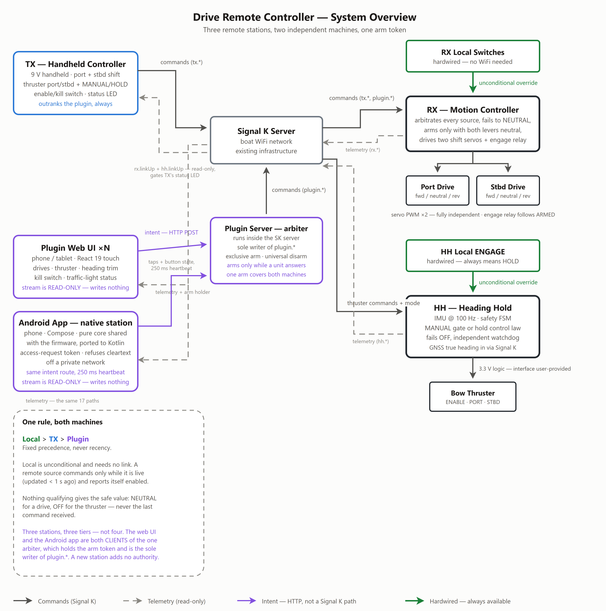
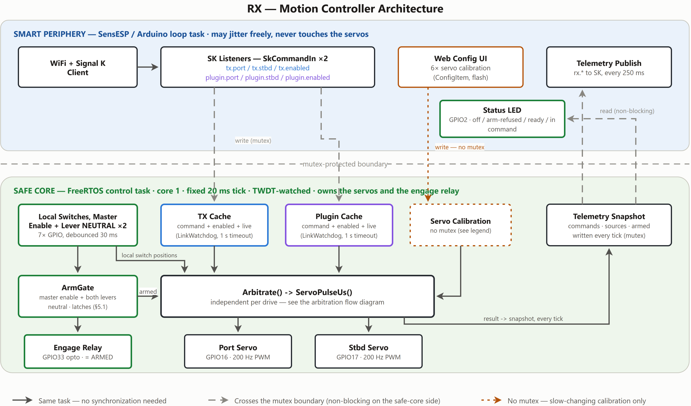
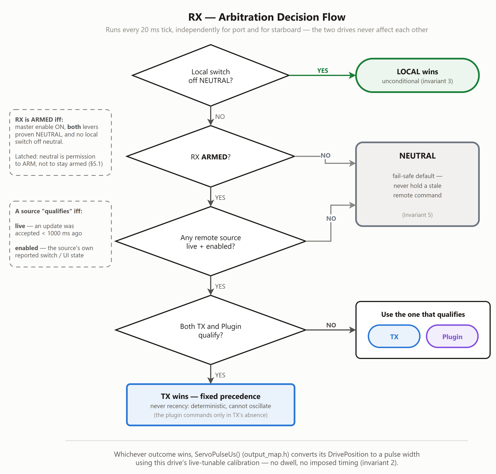
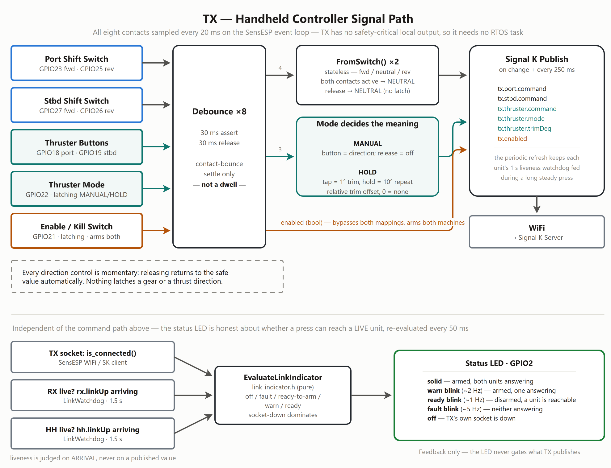
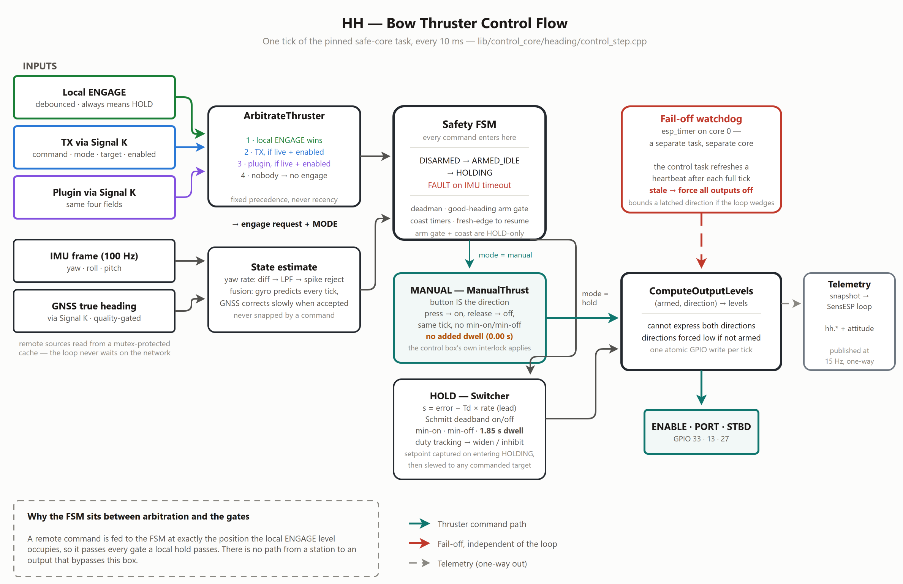
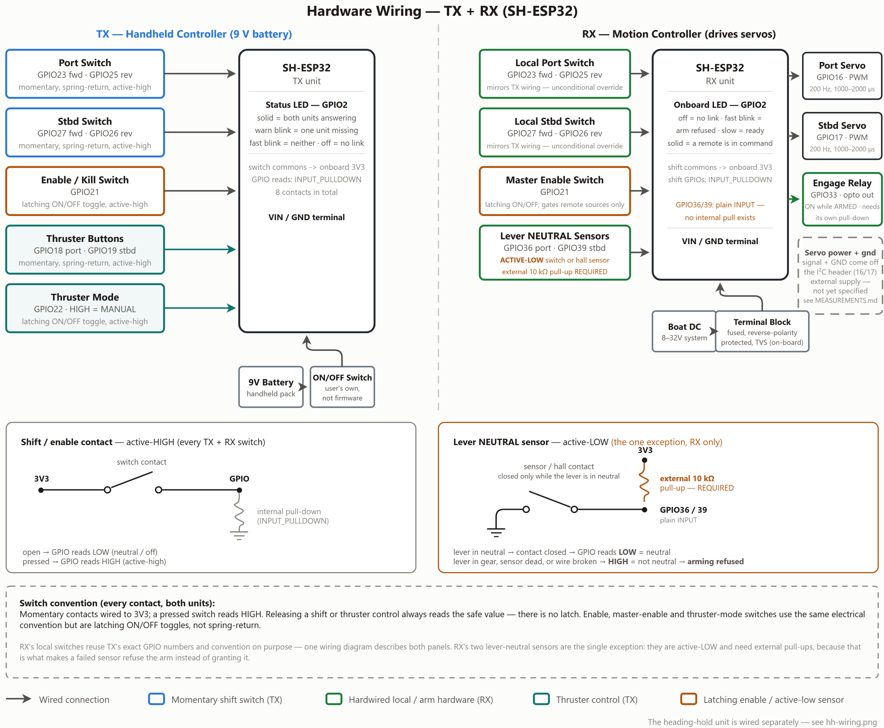
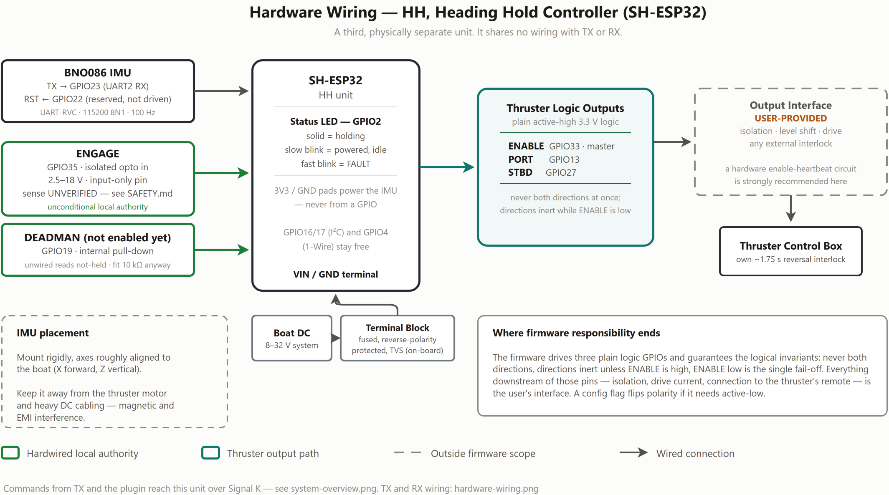

# Architecture

How the system is built and how it works. Read [SAFETY.md](SAFETY.md) alongside
this — it states the invariants this structure exists to guarantee.

- [1. System at a glance](#1-system-at-a-glance)
- [2. Repository layout](#2-repository-layout)
- [3. Runtime structure](#3-runtime-structure)
- [4. The pure core](#4-the-pure-core)
- [5. Drive control](#5-drive-control)
- [6. Bow thruster control](#6-bow-thruster-control)
- [7. Heading-hold control law](#7-heading-hold-control-law)
- [8. Liveness and link indication](#8-liveness-and-link-indication)
- [9. Signal K contract](#9-signal-k-contract)
- [10. The plugin](#10-the-plugin)
- [11. The Android station](#11-the-android-station)
- [12. Configuration](#12-configuration)
- [13. Hardware](#13-hardware)
- [14. Extending the system](#14-extending-the-system)

---

## 1. System at a glance

Three ESP32 firmwares, one Signal K plugin and one native Android app,
controlling **two independent machines** on the boat.

| Part | Build env | Source | Role |
|---|---|---|---|
| **TX** — Handheld Controller | `tx_shesp32` | `esp32/src/tx/` | Portable station: reads physical switches, publishes commands |
| **RX** — Motion Controller | `rx_shesp32` | `esp32/src/rx/` | Drives two servos that shift the port and starboard drives |
| **HH** — Heading Hold Controller | `hh_shesp32` | `esp32/src/hh/` | Drives the bow thruster: heading hold, or direct manual thrust |
| **Plugin Controller** | npm (`sk-plugin/`) | `sk-plugin/` | Node authority inside the Signal K server + a React web UI |
| **Android Controller** | Gradle (`android/`) | `android/` | Native phone station; a second *client* of the plugin's authority (§11) |



**The two machines are independent.** The drives and the bow thruster share no
wiring, no outputs and no interlock. What they *do* share is this repository,
`esp32/include/config.h`, the pure core in `esp32/lib/control_core/`, and their command
stations: TX, the browser UI and the Android app command both, under one arm
token.

**There are four stations but three authority tiers.** Precedence is local >
TX > plugin, and *both* phone stations sit in the plugin tier — they are
clients of the arbiter in `sk-plugin/`, which is the sole writer of the
`plugin.*` paths and grants the arm token to one client at a time. A station
added as a client adds no new authority and no new failure mode in the
arbitration; that is why §11 can be as thin as it is.

**Everything talks over Signal K.** There is no direct radio link between the
stations and the units; commands are published as Signal K deltas and relayed
by the boat's existing server. Both output units additionally have local
physical controls wired directly to them, which work with the network entirely
down.

---

## 2. Repository layout

```
esp32/                         PlatformIO project (own toolchain)
    include/
        config.h                  Pin maps, SK paths, tunables. Single source of truth.
        secrets.h                 WiFi/OTA credentials (see README).

    lib/control_core/             PURE C++17. No Arduino.h, no WiFi, no HardwareSerial.
                                  Host-testable under env:native. The include root is
                                  this directory, so headers carry a family prefix:
                                  "common/x.h", "drive/x.h", "heading/x.h".
        common/                   Shared by both machines
        drive/                    Drive (TX + RX) logic
        heading/                  Bow thruster (HH) logic

    src/tx/                       TX firmware: switch reads -> SK publish, status LED
    src/rx/                       RX firmware: safe core + SensESP periphery
    src/hh/                       HH firmware: safe core + SensESP periphery

    test/                         PlatformIO Unity suites, one directory per module,
                                  all run on the host under env:native

sk-plugin/                    Self-contained npm project (own toolchain)
    arbiter.cjs               Pure arming authority
    index.cjs                 Signal K I/O shell around the arbiter
    src/                      React 19 web UI
    static/                   Verbatim-copied assets (app icon, favicon)
    test/                     Server-side and end-to-end suites

android/                      Self-contained Gradle project (own toolchain)
    core/                     PURE Kotlin/JVM. No Android imports, no I/O.
                              The same split as lib/control_core/, and testable
                              on any laptop with a JDK -- no SDK needed.
    app/                      Compose UI, NsdManager, OkHttp, lifecycle glue

docs/diagrams/                Diagrams referenced by the docs. Each .png is
                              draw.io-editable (source embedded in the file);
                              the .drawio twin is the same content as XML, for
                              readable diffs. See README "Regenerating
                              documentation assets".
```

The split that matters: **`esp32/lib/control_core/` is pure and host-tested, `esp32/src/` is
hardware glue.** Any decision worth testing belongs in the pure core; `esp32/src/`
reads pins, calls into the core, and writes pins.

---

## 3. Runtime structure

Both output units use the same two-zone split.



### Safe core

A FreeRTOS task pinned to core 1, at a priority above the Arduino loop task,
running on a fixed period. It owns the outputs and never touches the network.

| Unit | Task period | Pipeline |
|---|---|---|
| RX | 20 ms (`kRxControlPeriodMs`) | local switches → cached remote commands → arbitration → drive mapping → servo write |
| HH | 10 ms (`kHhControlPeriodMs`, matching the IMU's 100 Hz frame rate) | IMU frame → yaw rate → heading fusion → arbitration → mode gate → FSM → output write |

HH additionally runs an **independent fail-off watchdog**: an `esp_timer`
callback dispatched from the high-priority timer service task on core 0
refreshes from a heartbeat the control task updates after each completed tick.
If the control task stalls or crashes, the watchdog forces ENABLE/PORT/STBD off
within roughly `kOutputFailoffTimeoutMs + kOutputFailoffCheckPeriodMs` instead
of leaving a direction latched until reboot.

### Smart periphery

SensESP on the Arduino loop task: WiFi, the Signal K client, the web
configuration UI, and telemetry publishing. It may jitter freely — under a WiFi
reconnect or a flash write — without affecting output timing.

### The boundary between them

One-way, mutex-protected, and non-blocking in the direction that matters:

- **Inbound:** SensESP's WebSocket callbacks write cached command state under a
  mutex. The control task reads it with a **zero-timeout** take — on the rare
  contended tick it reuses the previous cycle's copy rather than waiting.
- **Outbound:** the control task writes a telemetry snapshot under a mutex; the
  periphery reads it and publishes — RX at the 250 ms SK refresh cadence
  (`kSkPeriodicRefreshMs`, 4 Hz), HH at `kTelemetryPublishPeriodMs` (~15 Hz).

A control task never blocks on the network, and publishing never paces a
control loop.

TX has no safety-critical local output — it only publishes, and its two inbound
subscriptions feed nothing that moves: `rx.linkUp` and `hh.linkUp` arrivals
drive the status LED (§8). It subscribes to no setpoint at all — the heading
trim has been a relative, seedless offset since 2026-07-24 (§6.4) — so it runs
entirely on a plain SensESP `onRepeat` with no dedicated task.

---

## 4. The pure core

Everything here compiles and is tested on the host. No module reads a clock,
touches hardware, or allocates in a hot path; time arrives as a `now_ms`
argument, and "is this source live / is this heading trustworthy" arrives as a
boolean the caller has already evaluated.

### `common/`

| Module | Responsibility |
|---|---|
| `debounce.h` | Two-sided contact debounce: a level must be stably asserted for one period before the debounced state rises, and stably released for another before it falls. Used on every physical switch and contact on all three units. |
| `active_source.h` | The `ActiveSource` enum (`local`/`tx`/`plugin`/`none`) and its Signal K spelling, shared by both machines' arbitration. |

### `drive/`

| Module | Responsibility |
|---|---|
| `drive_command.h` | `DrivePosition` (`kForward`/`kNeutral`/`kReverse`), the mapping from a two-contact switch reading, and conversion to/from the SK string form. Structurally cannot represent an in-between state. |
| `link_watchdog.h` | Liveness as time-since-last-update. `Update(now)` on each accepted message, `IsLive(now, timeout)` to query. |
| `arm_gate.{h,cpp}` | RX's arm permission (§5.1): master enable plus the gear-neutral interlock. The one stateful module on the drive side — it latches, because neutral is permission to *arm*, not a condition of staying armed. |
| `arbitration.{h,cpp}` | The per-drive precedence rule (§5). Stateless; called once per drive. |
| `output_map.h` | `DrivePosition` → servo pulse width, using that side's calibration. |
| `link_indicator.h` | `{socket up?, RX live?, HH live?}` → the TX status LED state, plus the lamp-on decision for a given blink phase. |

### `heading/`

| Module | Responsibility |
|---|---|
| `rvc_parse.{h,cpp}` | The IMU's 19-byte UART-RVC frame parser: header sync, checksum, resync, frame timeout. |
| `yaw_rate.{h,cpp}` | Wrap-safe differentiation of yaw → low-pass filter → spike rejection. |
| `heading_filter.{h,cpp}` | Complementary filter: predict on the local gyro every tick, correct slowly toward GNSS true heading when a fresh, plausible fix arrives. Tracks the age of the last *accepted* correction. |
| `switcher.{h,cpp}` | The bang-bang control law for HOLD mode (§7): lead variable, Schmitt deadband, min-on/min-off, reversal dwell, duty tracking. |
| `manual_thrust.{h,cpp}` | The MANUAL-mode gate (§6): direct, untimed, with only the thruster control box's reversal interlock enforced. |
| `thruster_arbitration.{h,cpp}` | Who commands the thruster and in which mode (§6). |
| `setpoint.h` | Rate-limited, wrap-aware slew of the held setpoint toward `base + trim`; clamps the relative trim to ±`kMaxTrimDeg`, non-finite → 0. |
| `heading_nudge.h` | The commanding station's relative trim accumulator, plus `TrimHoldAllowed` — the "arm-first, then trim" gate every station applies to it (§6.4). |
| `safety_fsm.{h,cpp}` | `DISARMED` / `ARMED_IDLE` / `HOLDING` / `FAULT` and the transitions between them. |
| `output_map.h` | `(armed, direction)` → ENABLE/PORT/STBD logic levels. Cannot express both directions at once. |
| `control_step.{h,cpp}` | The wired per-tick pipeline for HH — every module above, in order, with no I/O. This is where integration behaviour is tested. |
| `angle_math.h` | Wrap to (−180, 180]. |

**`control_step.h` is the file to read first** if you want to understand HH: it
is the whole decision pipeline in one place, and `esp32/test/test_control_step/`
exercises it as scenarios rather than as unit calls.

---

## 5. Drive control



Run independently for port and starboard, every RX tick:

```
if local_switch != NEUTRAL:          output = local_switch
elif rx_armed:                       # §5.1 -- master enable AND neutral interlock
    if tx.live and tx.enabled:       output = tx.command
    elif plugin.live and plugin.enabled:
                                     output = plugin.command
    else:                            output = NEUTRAL
else:                                output = NEUTRAL
```

Reading the rules out:

1. **RX's own local switch is unconditional.** Off NEUTRAL it drives that drive
   directly, regardless of RX's arm state, TX's enable, or any link state.
   This works with TX dead and the network down.
2. **RX's arm state gates remote sources only**, never the local switches.
3. **A remote source must be both live and enabled.** "Live" is
   time-since-last-update (`kSkStalenessTimeoutMs`, 1000 ms). "Enabled" is that
   source's own reported state, published explicitly rather than inferred from
   silence.
4. **TX outranks the plugin by fixed precedence** — not recency. When both
   qualify and disagree, the outcome is deterministic and cannot oscillate.
5. **Otherwise NEUTRAL.** The last remote command is never held.

Port and starboard are fully independent: one FORWARD while the other is
REVERSE is normal operation, and nothing couples them.

**No imposed timing.** A winning command reaches the servo as fast as the 20 ms
loop allows. The only time element anywhere in this path is contact-bounce
debounce on the physical switches.

### 5.1 The arm gate — gear-neutral interlock and the engage relay

`drive/arm_gate.{h,cpp}`. RX may only take command when **both shift levers are
proven to be in neutral**. Each lever carries a switch or hall sensor that pulls
its GPIO to ground while the lever sits in neutral; RX also drives one output,
the **actuator-engage relay** (servo clutch / servo power), which is energised
exactly while armed.

```
if master_enable == OFF:                        DISARMED   (always, immediately)
elif port_neutral and stbd_neutral
     and no local switch is off neutral:        ARMED
else:                                           hold current state
```

Three things about this are deliberate:

1. **Neutral is permission to arm, not a condition of staying armed.** RX's own
   servos move the levers, so the neutral sensors open the moment an armed
   remote commands gear. Enforcing neutral continuously would disarm RX on its
   first shift — a machine fighting itself. Same shape as a car's
   neutral-safety switch: it gates the starter, not the running engine.
2. **Arming also requires RX's own local switches at neutral.** While disarmed
   the clutch is released, so a held local switch can park a servo at FORWARD
   against a lever reading NEUTRAL. Energising the clutch there would slam that
   lever into gear. Requiring local neutral means the servos match the levers
   the clutch is about to grab.
3. **Level-based, no enable edge required** (owner decision, 2026-07-25).
   Returning the levers to neutral with the master enable left ON re-arms on the
   next tick.

Disarm is never gated on anything: master enable OFF releases the relay on the
next tick regardless of lever position, matching the cross-cutting stop rule.
Boot lands DISARMED, and `begin()` releases the relay as the firmware's very
first hardware action — before the servos are even attached — so a servo left
in gear cannot be transmitted to a lever at power-up.

A refusal is never silent: `rx.armInhibit` names the one blocker to fix
(`masterEnableOff`, `portLeverNotNeutral`, `stbdLeverNotNeutral`,
`bothLeversNotNeutral`, `localCommandActive`; empty while armed), and RX's LED
blinks the ~5 Hz fault pattern whenever the master enable is ON but the
interlock is holding the arm back.

### TX's signal path



Every 20 ms TX samples all its switches, debounces each contact, maps the shift
pairs to a `DrivePosition` and the thruster pair to a direction or a heading
trim, then publishes **on change plus a 250 ms periodic refresh**
(`kSkPeriodicRefreshMs`). The periodic refresh is what keeps each consumer's
liveness watchdog fed during a long steady press.

---

## 6. Bow thruster control



The thruster runs in one of two **explicitly selected** modes. Mode is published
and displayed, never inferred from which button was last pressed.

| Mode | Who decides direction | Timing applied |
|---|---|---|
| `hold` | The bang-bang `Switcher` from heading error and yaw rate | Full control law: deadband, min-on, min-off, reversal dwell (1.85 s), duty |
| `manual` | The operator's button, directly | **None** — `kManualReversalDwellS` is 0; the control box's own interlock is the only delay (§6.3) |

### 6.1 Arbitration

`heading/thruster_arbitration.{h,cpp}`, every HH tick:

```
if local ENGAGE asserted:     local wins unconditionally, and always means HOLD
elif tx.live and tx.enabled:  tx's mode + command
elif plugin.live and plugin.enabled:
                              plugin's mode + command
else:                         no engage request -> ENABLE drops, outputs off
```

Same precedence shape as the drives, so there is one rule for the whole boat.
Two structural properties are enforced in the result itself rather than trusted
to callers: a manual direction cannot survive into HOLD, and a commanded trim
cannot survive into MANUAL.

### 6.2 Where a remote command enters

The arbitrated `engage_request` is fed to `SafetyFsm` **at exactly the position
the local ENGAGE level occupies**. A remotely commanded thrust therefore travels
the same path as a locally engaged hold and passes every gate on it — IMU
timeout, deadman, the ENABLE master gate, the never-both-directions rule, and
the independent fail-off watchdog.

Two HOLD-specific preconditions are adapted in MANUAL mode, and only these two:

| Precondition | HOLD | MANUAL | Reason |
|---|---|---|---|
| Good-heading arm gate | required | not required | The gate exists so the loop never steers against a heading it cannot trust. Manual consults no heading — the operator's eyes are the reference. |
| GNSS coast timers | active | inert | Nothing is being held, so there is nothing to coast. |

### 6.3 The manual gate

`heading/manual_thrust.{h,cpp}`. Press and the thruster runs on that tick;
release and it stops on that tick. **No min-on, no min-off, no anti-chatter, no
deadband** — a person is holding the button and watching the boat.

**The manual gate applies no reversal dwell of its own**
(`kManualReversalDwellS` = 0.00 s, owner decision 2026-07-24). The thruster's
control box enforces its own ~1.75 s anti-reversal interlock in hardware and
will not accept the opposite direction during it whatever the firmware asks
for, so the firmware asking early costs nothing the box does not already
refuse — while a firmware-imposed wait made the control feel dead during
docking, which is exactly when it is needed. A port→stbd flick therefore passes
through OFF for a single tick and the opposite direction asserts immediately;
`reversalPending` does not publish in this mode, so the UI's "reversing" note
does not appear. Same-direction re-pulsing is never delayed either.

This is the one place the two modes deliberately differ. HOLD keeps the full
measured dwell (`kReversalDwellS`, 1.85 s) because the `Switcher` is an
automatic loop with nobody watching the tunnel — see SAFETY.md thruster
invariant 7 for the reasoning, and `config.h` for the `static_assert` that pins
HOLD's floor. `ManualThrust` still implements the dwell in full: raising
`kManualReversalDwellS` above 0 re-enables the wait (and `reversalPending`) with
no other change.

Whichever dwell applies, both gates measure it against the **same shared
last-thrust history**. `ControlStep` tracks the direction the thruster was
physically last driven in, across both gates and every mode change, and seeds
whichever gate takes over. The control box's interlock is a property of the box
and knows nothing about which gate commanded the previous thrust, so clearing
that history on a mode change let a two-tap mode flip walk straight past the
dwell — thrust PORT in MANUAL, tap HOLD, and the switcher would reverse after
`min_off` (0.5 s) instead of 1.85 s. Seeding carries the facts; each gate
applies its own policy to them, which is what keeps the asymmetry intact.

The gate is also structurally interlocked: the only exit from a direction is
through OFF, so a direct direction-to-direction transition is not expressible.

### 6.4 Commanded heading trim (HOLD mode)

When hold engages, **HH captures the heading it is on** as a fixed base. The
commanding station then owns a **relative trim offset** from that base — not an
absolute target — published as a level (`thruster.trimDeg`, degrees). HH slews
its setpoint toward `base + trim`, rate-limited to `kSetpointSlewDps` (10°/s).
The trim magnitude is clamped to `kMaxTrimDeg` (±45°).

- **Relative, so 0 is the resting value.** A station that is not trimming
  publishes `0`, which means "hold the captured heading". Because 0 is a real,
  well-defined command, there is **no sentinel**: nothing out-of-band is needed
  to say "not commanding", and a JSON `null` (which the firmware's float
  listener reads as `0.0`) means exactly that safe rest — where an absolute
  target would have read it as a bogus "hold 0°/north" (the reason the old
  design carried a 999 sentinel, now removed).
- **A self-correcting level, not accumulated events.** The wire value is the
  whole offset, so the last message received is the truth, a repeat is
  harmless, and a restart re-seeds to 0 rather than replaying history.
- **No seed needed.** The offset is self-contained: a press is well-defined
  without the station knowing anything about HH's heading.
- **Fails soft, clamped.** A corrupted or stale offset is at most `kMaxTrimDeg`
  of trim, never an arbitrary heading. Non-finite reads as 0.
- **Only the setpoint moves.** The fused-heading estimate is never snapped by a
  trim or a mode change.
- **Arm-first, then trim.** Arming holds the captured heading (trim 0); trimming
  is a deliberate action taken afterward. **Every** station enforces this by
  resetting its trim to 0 whenever the thruster is not commandable from it, so
  arming never swings the boat to an offset dialled in earlier. The condition is
  `control_core::TrimHoldAllowed` (HOLD mode, this station enabled, HH answering)
  — stated once in the pure core because all three stations owe it and each
  implements it in its own language: TX in its sample loop, the plugin in
  `App.tsx`, the Android station in `StationViewModel`. TX originally omitted the
  *station enabled* term, and on TX the enable switch **is** the arm, so a trim
  dialled in while disarmed was applied by the act of arming.

On TX, the two thruster buttons do the trimming while the mode switch is in HOLD
(tap = 1°, hold = repeat 10°). The plugin uses four discrete −10/−1/+1/+10
buttons. Both accumulate the same clamped relative offset.

### 6.5 One arm, two machines

A single arm token covers the drives and the thruster; there is no separate
thruster arm to fall out of step with the drive arm.

- Arming is granted while **either** unit's telemetry is arriving, and refused
  when **neither** is.
- An existing arm is released when **both** are gone. A returning unit never
  silently re-arms: arming is edge-triggered.
- **Disarm is never gated on anything.**
- The missing unit is named on the arm control and in the plugin's status line.
- Per-machine command gating still applies: drive widgets go live only with a
  live RX, thruster controls only with a live HH.

---

## 7. Heading-hold control law

All angles in degrees internally, wrapped to (−180, 180]; heading increases
clockwise and starboard thrust increases heading. Conversion to radians happens
only at the Signal K boundary.

**Yaw rate** (`yaw_rate.{h,cpp}`) — the IMU supplies fused yaw at 100 Hz:

```
Δ = wrap(yaw[k] − yaw[k−1])
if |Δ| > spike threshold:  reject this sample
r = LPF(Δ / dt)
```

**Heading fusion** (`heading_filter.{h,cpp}`) — fast local prediction, slow
absolute correction:

```
fused += r * dt                                   every tick
fused += k * wrap(gnss − fused)                   on each fresh, accepted fix
   where k = 1 − exp(−dt_gnss / tau_corr)           dt_gnss = interval since the
                                                  last ACCEPTED fix
```

The correction is specified as a convergence *time constant*, not as a per-fix
gain, and `k` is derived from the actual interval between accepted fixes. That
matters because the fix rate is not a property this code gets to assume: it was
taken to be ~5 Hz from a subscribe throttle, measured at 1 Hz, and then
reconfigured to 10 Hz, all without the tuning intent changing. A time constant
means the same thing at every one of those rates. The constant is deliberately
long relative to a fix interval, so the loop stays biased toward the gyro and
network jitter never reaches the controlled variable. A GNSS sample is
accepted only when it is fresh, quality-passed by its publisher, and physically
plausible. The filter tracks the age of the last *accepted* correction — not
mere arrival — so a stream of fresh-but-rejected fixes cannot look current to
the arm gate or the coast timers.

**Switching** (`switcher.{h,cpp}`) — bang-bang on a lead variable:

```
e = wrap(setpoint − fused)
s = e − Td * r                       lead term anticipates, preventing overshoot

if not thrusting and s >  on_thr:    request STBD
if not thrusting and s < −on_thr:    request PORT
if thrusting and elapsed >= max_on:  request OFF   (cap -- see below)
if thrusting and |s| < off_thr:      request OFF

then, before the request reaches the output:
  min_on         once on, stay on at least this long (the thruster must bite)
  min_off        once off, stay off at least this long (anti-chatter)
  reversal_dwell after leaving a direction, no opposite direction for this long
```

`off_thr < on_thr` gives the Schmitt deadband. Duty is tracked over a sliding
window: above `duty_warn` the deadband widens, above `duty_max` new activations
are inhibited, protecting the thruster's short-time rating.

Note the release condition is a *rate* test in disguise: solving
`e - Td*r < off_thr` for `r` gives `r > (e - off_thr) / Td`, i.e. "run until the
vessel is turning this fast, then stop and reassess". Td is therefore the
gentleness knob -- raising it releases at a lower rate, giving shorter pulses
and less overshoot.

`max_on` bounds ONE continuous thrust. The control law normally releases long
before it; the cap exists for the case where it never would, because the boat
is not answering at all -- pinned by wind or current, a fouled thruster, a dead
or wrong-signed yaw rate. There `s` stays at `e` indefinitely and, before the
cap, nothing else ended the pulse: `duty_max` inhibition is consulted only when
*leaving* OFF, so it can refuse the next activation but cannot interrupt one
already running. Capping the pulse is what gives the duty limiter an OFF window
to act in, and turns a continuous burn under sustained load into a pulse
train.

**The FSM** (`safety_fsm.{h,cpp}`) owns arm state:

| State | Meaning | ENABLE |
|---|---|---|
| `DISARMED` | No engage request, or the deadman is released | low |
| `ARMED_IDLE` | Engaged and healthy, not actively commanding | high |
| `HOLDING` | Actively commanding (in either mode) | high |
| `FAULT` | IMU frame timeout | low |

Leaving `HOLDING` for any reason requires a **fresh engage edge** to resume.
Thrust never silently restarts because a sensor recovered. `JustEnteredHolding()`
is the one-shot cue to capture a fresh setpoint and reset the switcher, so stale
timing from a previous session cannot leak into a new one.

---

## 8. Liveness and link indication

**Liveness is judged on message arrival, never on a message's value.** Signal K
retains a path's last value indefinitely, so a value published by a unit stands
at its last reading forever once that unit loses power — reading it can never
reveal the unit's absence. Only the deltas stopping can.

This rule is implemented in four places, deliberately identically:

| Consumer | Mechanism | Window |
|---|---|---|
| RX, per remote source | `LinkWatchdog` fed by each accepted command update | `kSkStalenessTimeoutMs` (1000 ms) |
| TX, per unit | `LinkWatchdog` fed by `rx.linkUp` / `hh.linkUp` arrivals | `kRxTelemetryStaleMs` / `kHhTelemetryStaleMs` (1500 ms) |
| Plugin server, per unit | Arrival timestamps in `arbiter.cjs` | 1500 ms |
| Plugin UI, per unit | `getReceivedAt()` plus a timer | `RX_TELEMETRY_STALE_MS` (1500 ms) |

The UI needs its own clock because staleness is the *absence* of events —
nothing will ever notify a consumer that a link died.

**One blink vocabulary across all three units.** Every unit's onboard LED uses
the same patterns, so one glance reads the same anywhere on the boat:

| Pattern | Meaning |
|---|---|
| off | Not reachable to be armed — the unit's own link is down (or it is unpowered) |
| ~1 Hz slow blink | **Ready to be armed** — powered, connected, but not armed / not commanding |
| solid | Armed / in use — actively commanding (or, HH, holding heading) |
| ~2 Hz blink | (TX only) armed, but exactly one commanded unit is unreachable |
| ~5 Hz fast blink | Fault — nothing reachable (TX), or IMU frame timeout (HH) |

**TX's status LED** (`drive/link_indicator.h`, pure and host-tested) reports
whether a command can actually reach a live unit, and whether TX itself is
armed:

| State | Condition | Pattern |
|---|---|---|
| `kOff` | TX's own socket down | off |
| `kFault` | Socket up, **neither** unit answering (nothing to arm) | ~5 Hz blink |
| `kReadyToArm` | Socket up, a unit is live, TX's enable switch **off** | ~1 Hz blink |
| `kWarn` | **Armed**, socket up, exactly **one** unit answering | ~2 Hz blink |
| `kReady` | **Armed**, socket up, **both** units answering | solid |

The false-confidence rule is preserved through the arm dimension: a solid or a
slow "ready" light **never** appears unless a commandable unit is actually live
(nothing reachable is always `kFault`). While disarmed, the LED just says
"ready to be armed"; the per-unit "which one is missing" detail returns as soon
as TX is armed, which is when the operator is actually commanding and needs it.
Socket-down dominates: with no connection, both liveness verdicts are
last-known, so blaming a unit would be wrong.

**RX's status LED** follows the same vocabulary without the pure module (it has
one link verdict, not two), with a fourth state for the arm interlock (§5.1):
**off** when RX's own socket is down (it cannot be armed remotely), **fast
blink** (~5 Hz) when the master enable switch is ON but the interlock is
refusing to arm — the same "look at me" rate HH uses for FAULT, and the panel's
way of saying *check the levers* rather than reporting a fault; **slow blink**
when ready to be armed, or armed with nothing commanding; and **solid** when RX
is armed *and* a remote source is live+enabled, i.e. a station is actually in
command. Local switches drive the servos regardless — the LED reports remote-arm
readiness, not the directly visible local override.

**HH's status LED** uses the same vocabulary and the same link gate: **off**
when HH's own socket is down, **slow blink** while disarmed or armed-idle
(powered and ready), **solid** while `HOLDING`, **fast blink** on a `FAULT`
(IMU frame timeout). Socket-down
dominates on HH for the same reason it does on RX and TX, and it is truthful
here rather than merely consistent: HH's heading reference arrives over Signal
K, so with the socket down there is nothing to arm on and no station can
command the thruster. A dark LED therefore means the same thing on all three
units — *this one cannot be armed right now*.

The LED is **feedback only** — it does not gate what TX publishes. RX and HH
fail safe on their own, and suppressing the authoritative station's commands
because of a one-directional return-path glitch would be worse than a briefly
cautious light.

---

## 9. Signal K contract

All paths live under `control.remoteController.`. Command strings are exactly
`forward`/`neutral`/`reverse` for drives and `port`/`off`/`stbd` for the
thruster; **any unrecognised, missing or malformed value is read as the safe
one** (`neutral`, `off`, `hold`) rather than guessed at.

### Published by TX

| Path | Type | Meaning |
|---|---|---|
| `tx.port.command` | string | Port shift switch position |
| `tx.stbd.command` | string | Starboard shift switch position |
| `tx.enabled` | bool | TX's enable switch — gates **both** machines |
| `tx.thruster.command` | string | Thruster direction (MANUAL) |
| `tx.thruster.mode` | string | `manual` or `hold` |
| `tx.thruster.trimDeg` | number (deg) | Commanded hold trim, relative to HH's captured heading; 0 = no trim, clamped ±45 |

### Published by the plugin server

Identical shape under `plugin.`, plus:

| Path | Type | Meaning |
|---|---|---|
| `plugin.activeClient` | string | Which UI instance holds the arm token (`''` = none) |
| `plugin.rxLive` | bool | Server's verdict: is RX telemetry arriving? |
| `plugin.hhLive` | bool | Server's verdict: is HH telemetry arriving? |

**No station in the plugin tier writes anything to Signal K** — not the browser
UIs, not the Android app. Their per-instance intents are HTTP POSTs to the
plugin's own route, so no per-tab and no per-phone node appears in the data
model, and the arbiter stays the sole writer of `plugin.*`.

The Android station consumes the same 17 paths the browser UI does, through one
read-only WebSocket subscription. Its copy of the path names and timings is
`android/core/.../SkContract.kt`, hand-synced with `sk-plugin/src/config.ts` and
`esp32/include/config.h` (§12).

### Published by RX

| Path | Type | Meaning |
|---|---|---|
| `rx.port.state` / `rx.stbd.state` | string | Currently commanded position |
| `rx.port.source` / `rx.stbd.source` | string | `local`/`tx`/`plugin`/`none` |
| `rx.masterEnable` | bool | RX's master enable switch — the raw contact |
| `rx.armed` | bool | RX is permitting remote command and the engage relay is energised (§5.1). **This, not `masterEnable`, is what a station should believe** |
| `rx.port.leverNeutral` / `rx.stbd.leverNeutral` | bool | That lever's neutral sensor, debounced |
| `rx.armInhibit` | string | Why arming is refused; `''` while armed |
| `rx.linkOk` | bool | At least one remote source live **and** enabled |
| `rx.linkUp` | bool | At least one remote source live (armed or not) |

### Published by HH

| Path | Type | Meaning |
|---|---|---|
| `hh.thruster.state` | string | Direction currently being driven |
| `hh.mode` | string | `manual` or `hold` |
| `hh.source` | string | `local`/`tx`/`plugin`/`none` |
| `hh.setpointDeg` | number (deg) | Live setpoint — the heading being held, or (when not holding) the heading hold would take if it engaged now |
| `hh.armed` | bool | FSM is in `ARMED_IDLE` or `HOLDING` |
| `hh.linkUp` | bool | At least one remote source live |
| `hh.reversalPending` | bool | A direction is being withheld for the reversal interlock |

`hh.setpointDeg` and the `sensors.headingHold.setpoint`/`.error` pair are driven
by the switcher only while HOLDING in HOLD mode. In **every other state** —
disarmed, armed-idle, faulted, or hand-steering in MANUAL — the setpoint
**mirrors the fused heading**, so the reported error is a truthful zero instead
of a stale number growing against a heading nobody is holding. The mirror is
inert by construction: entering HOLDING re-captures the setpoint from the fused
heading anyway, the switcher does not run outside HOLD, and there is no integral
term to wind up. A consumer that needs to distinguish "holding this" from "would
hold this" reads `hh.armed` + `hh.mode` (or `sensors.headingHold.fsmState`) —
the value itself is live in both cases and must never be labelled "holding"
unconditionally. Note what was deliberately NOT done: publishing a literal `0`
for the error while disarmed would be indistinguishable from a perfect hold,
which is the one reading nobody questions.

HH also publishes standard telemetry outside this tree: `navigation.attitude`
(compound, radians), `navigation.rateOfTurn` (rad/s), and `sensors.headingHold.*`
tuning signals. Those follow Signal K's SI convention; the `control.*` tree is
operator-facing and uses degrees, with the unit named in the path.

**Both output units republish their whole telemetry set every cycle** whether or
not anything changed. That steady stream is what every liveness check in §8
depends on.

---

## 10. The plugin

`sk-plugin/` is a self-contained npm project with two halves.

### Server half — the arming authority

`index.cjs` is a thin Signal K I/O shell; **all arbitration lives in the pure,
host-tested `arbiter.cjs`** — the server-side analogue of the firmware's
`esp32/lib/control_core/`.

Each open browser instance POSTs its own intent to
`POST /plugins/<id>/intent` on a ~250 ms heartbeat:

```
{ clientId, seq, armReq, disarmReq, port, stbd, thruster, thrusterMode, trimDeg }
```

`seq` increments on every send and is **enforced per client**: an intent whose
`seq` is not strictly greater than the last accepted one is discarded whole, so
a delayed heartbeat re-delivered out of order can neither revert live commands
nor touch the edge baselines. `armReq`/`disarmReq` are rising-edge counters —
one increment per operator tap — and their stored baselines are additionally
clamped monotonic, so a replayed old counter value can never read as a fresh
tap (the silent re-arm the 2026-07-23 review found and closed).

The arbiter is the **sole writer** of the `plugin.*` paths and enforces:

- **Exclusive arm.** At most one client holds the token. A fresh arm edge is
  granted only when nobody holds it and at least one unit is live.
- **Universal disarm.** A disarm edge from *any* client releases the token
  immediately, whether or not that client holds it.
- **Edge, not level.** A client heart-beating an old `armReq` across a release
  can never silently re-arm.
- **Stale eviction.** A client that stops heart-beating is dropped after
  `staleTimeoutMs`; if it held the token, the token releases.
- **Fail to safe.** No live holder ⇒ `enabled=false`, both drives NEUTRAL,
  thruster OFF, trim 0 (hold whatever heading HH captures).

Intents travel over HTTP rather than as deltas so that per-tab plumbing never
enters the Signal K data model. `signalk-server` wraps `/plugins/*` with its
auth middleware, so an unauthenticated intent is rejected exactly as an
unauthenticated delta write would be dropped.

#### Route permission — `readwrite`, deliberately not admin

`/intent` is registered through the server's **access-scoped registrar**,
`router.access('readwrite').post(...)`, not directly on the plugin router.
The distinction is load-bearing rather than stylistic: in `signalk-server`, a
route registered *directly* keeps the `/plugins` gate's **admin-only** default,
and only routes registered through the registrar admit readwrite clients
(`asPluginRouter()` in the server's `src/interfaces/plugins.ts`).

Commanding is a write, not an administrative act. Admin-only was also
accidental — it worked only because a browser opened from the SK admin UI
carries an admin session cookie, which is why `sk-plugin/README.md` tells the
operator to do exactly that. Anything authenticating as a plain readwrite
client is rejected under that default, and that includes **every station
holding a Signal K access-request token** — the mechanism TX, RX and HH use.

The registration is feature-detected: `router.access` is a recent server API,
and on a server without it the route falls back to the admin-only default. The
browser UI is unaffected either way; a token station on such a server needs its
access request approved at **admin** level instead of readwrite.

> **Confirmed on this boat's server (2026-07-25): `signalk-server` 2.30.0 has
> `router.access`,** so the readwrite registration is live and the admin
> fallback is *not* in play. The Android station holds an ordinary read/write
> token and its intent POSTs are accepted. This was found the hard way — the
> app got HTTP 401 on every intent until the plugin carrying this registration
> was actually deployed, because the server was still running an older build.
> **A plugin deployed without it reintroduces the 401 for every token station,
> including TX, RX and HH.**

Which mode a *different* server is in is confirmed at commissioning, not
assumed:

```bash
SK=http://192.168.0.100:3000
# 1. request a token, then approve it in the SK admin UI under
#    Security > Access Requests (choose the read/write permission level)
curl -X POST $SK/signalk/v1/access/requests \
  -H 'Content-Type: application/json' \
  -d '{"clientId":"'"$(uuidgen)"'","description":"Drive Remote Control (commissioning)"}'
curl $SK/signalk/v1/access/requests/<id>        # poll until COMPLETED -> token

# 2. the two calls a token station makes. Both must succeed; a 401/403 on the
#    second means the route is still admin-only on this server.
curl -i -H "Authorization: Bearer $TOK" "$SK/signalk/v1/stream" # expect 426 Upgrade
curl -i -H "Authorization: Bearer $TOK" -H 'Content-Type: application/json' \
  -X POST $SK/plugins/signalk-drive-remote-controller/intent \
  -d '{"clientId":"commissioning","seq":1,"armReq":0,"disarmReq":0,"port":"neutral","stbd":"neutral","thruster":"off","thrusterMode":"manual","trimDeg":0}'
```

Some server versions accept only the `JWT <token>` prefix rather than
`Bearer <token>`; if the first call returns 401, retry with `JWT` before
concluding the token is bad.

### Browser half — the UI

The UI's WebSocket is **read-only**: it subscribes to `/signalk/v1/stream` and
never publishes a delta. It derives its own armed state from
`activeClient === myClientId` — from the authority, never from a local guess —
so every open instance agrees on who is in control.

| File | Responsibility |
|---|---|
| `src/App.tsx` | State, intent assembly, the 250 ms heartbeat |
| `src/components/DriveControl.tsx` | Per-drive momentary forward/reverse |
| `src/components/ThrusterControl.tsx` | Mode toggle, manual buttons, heading trim |
| `src/components/KillSwitch.tsx` | Arm/disarm, and the reasons it is unavailable |
| `src/components/StatusPanel.tsx` | Traffic-light lamps |
| `src/pure/driveCommand.ts` | Direct port of `drive/drive_command.h` |
| `src/pure/trimOffset.ts` | Relative heading-trim accumulator; counterpart of `heading/heading_nudge.h` |
| `src/pure/rxLiveness.ts` | Arrival-based liveness verdict |
| `src/hooks/useMomentaryButton.ts` | Per-button, per-pointer-ID press tracking |
| `src/skClient.ts` | WebSocket client, subscription cache, reconnect |

**Multi-touch is per-pointer**, not a single "currently pressed" variable, so
two fingers on two different buttons both take effect. Two buttons on the *same*
side resolve to the safe value, matching the firmware's truth table.

**Release is forced on more than a clean lift**: `pointercancel`, the tab going
hidden, the window losing focus, dragging off the button without pointer
capture, and losing the pointer capture all release a button, so an interrupted
touch cannot leave a drive commanded.

**Selecting a thruster mode is not commanding one, and the two are gated
differently.** Every control that reaches the thruster — the PORT/STBD contacts,
the trim steps — is inert unless this station holds the token, the socket is up
and HH is answering. The MANUAL/HOLD chooser is outside that gate in both
stations (`ThrusterControl.tsx`, `ui/Controls.kt`): it decides which gate the
*next* arm opens, which is a choice made before arming. Nothing about the
authority model changes — a non-holder's mode is published nowhere (`state()`
reads it only from the holder's record), and a holder's is masked to `manual`
with direction OFF whenever HH is not commandable. That rest tuple is chosen
because it is *inert* on HH (ENABLE asserted, both direction lines low — an
armed MANUAL operator with no finger down); `hold` beside `enabled: true` is
not a rest value at all but an engage request, which would enter HOLDING the
moment HH's heading was good, off a returning telemetry frame rather than an
operator action. `hold` remains the default for an unrecognised mode value and
for the no-holder tuple, where `enabled: false` makes it inert. What does
follow, and is stated on the widget
while disarmed, is that **arming with HOLD selected engages the hold with no
further press**; the disarmed panel also labels the readout as the current
heading, since HH mirrors that path to the fused heading when it is not holding
(§9). The firmware is untouched: an arm straight into HOLD still measures both
reversal dwells against the same shared last-thrust history (§6.3).

**Nothing derived is shown as live when it cannot be confirmed.** Lamps grey out
when the socket is down or when the unit that publishes them has gone quiet, and
the kill switch renders a distinct OFFLINE state while disconnected rather than
a confident ARMED — or a false DISARMED: the socket is only the read side, and
the intent heartbeat keeps POSTing over HTTP, so the tab may still genuinely
hold the token. The OFFLINE tap therefore stays live and always means STOP;
disarm is never gated on the read socket's health (SAFETY.md).

Screenshots of every operating state are in
[sk-plugin/README.md](../sk-plugin/README.md), captured from the real built app driving
the real arbiter.

---

## 11. The Android station

`android/` is a native Compose app: a fourth station commanding the same two
machines under the same rules. Not a WebView wrapper and not a PWA — it
discovers or is pointed at any Signal K server and authenticates with a token
obtained through the **Signal K access-request flow**, the same mechanism TX, RX
and HH use through SensESP's `SKWSClient`.

Full setup, build and toolchain instructions are in
[android/README.md](../android/README.md).

### Why it can be thin

Everything safety-critical is server-side in `arbiter.cjs` (§10) — the exclusive
arm token, universal disarm, edge-triggered requests, stale eviction,
fail-to-safe. This app is a new *client* of that authority, not a new authority.
Its entire contract with the boat is two things:

- **read** — one WebSocket to `/signalk/v1/stream`, one subscribe message, the
  same 17 paths the browser UI takes
- **write** — `POST /plugins/signalk-drive-remote-controller/intent`, a flat
  JSON object, on change plus a 250 ms heartbeat

Intent POSTs share one ordered lane, so a delayed press cannot arrive after its
release. Leaving the foreground stops the heartbeat after queuing a safe intent;
returning resumes it only for a still-active session. WebSocket callbacks carry
a connection generation, preventing a closing old socket from overwriting the
state of its replacement.

It deliberately does **not** act as a TX-like station writing deltas directly.
That would bypass the arbiter entirely — no exclusive arm, no universal disarm,
no cross-station stale eviction — and two stations writing the same `plugin.*`
paths would reproduce the oscillating merged-value bug the arbiter exists to
prevent.

### Module split

The same split as everywhere else in this project, for the same reason.

| Module | What | Analogue |
|---|---|---|
| `core/` | Pure Kotlin/JVM. No Android imports, no clock reads, no I/O. Everything that **decides** something, host-tested. | `esp32/lib/control_core/`, `arbiter.cjs` |
| `app/` | Compose UI, `NsdManager`, OkHttp, `DataStore`, lifecycle. Reads inputs, calls the core, writes outputs. | `esp32/src/`, `index.cjs` |

`:app` is only configured when an Android SDK is present, so `:core:test` — and
therefore the whole safety suite — runs on any machine with a JDK, exactly as
`pio test -e native` runs the firmware core with no ESP32 attached. CI runs it
with no SDK installed on purpose: if `:core` ever needs one, something
Android-specific has leaked into the pure layer.

`core/` carries direct ports of the shared decisions — the drive truth table,
the trim clamp, arrival-based liveness, fixed source precedence, delta parsing,
reconnect backoff — plus three things with no counterpart elsewhere:
`AccessRequest.kt` (the token flow; the browser has a session cookie instead),
`ServerAddress.kt` (the browser reads `window.location` instead), and the two
below.

### Two decisions that are specific to being a phone

**The cleartext gate** (`PrivateAddress.kt`). The app refuses plain `http` to
anything that is not on a private network; `isCleartextSafe` is
`useTls || isPrivateHost(host)`, and anything the parser does not recognise
returns false, so an unfamiliar address is refused rather than trusted. It is
enforced in `useServer()`, the single point a typed address and a tapped
discovery result both pass through, before anything is stored and before any
socket opens — so the token cannot leave over cleartext.

This lives in tested Kotlin rather than in `network_security_config.xml`
because it **cannot be expressed there**: Android matches a `<domain>` by
suffix, which is correct for DNS names and useless for IP addresses, whose
network part is a prefix. `192.168.0.100` does not end with `.192.168`. The
config has no CIDR syntax and the server's address is not known at build time.

**Token health** (`TokenHealth.kt`). A 401 does not mean the token is dead: both
this app and the browser UI probe `Bearer` then `JWT`, because signalk-server
has historically accepted only one or the other, so every rejection before the
right scheme is the handshake working. `TokenHealth` counts *consecutive*
rejections and declares death only past `AuthScheme.TRY_ORDER.size + 1`, derived
from the list rather than hard-coded. A transport failure is never fed in —
losing the network is not losing authority, and the station must stay on the
control screen while offline because its disarm has to keep working when it
cannot see the boat.

When a token really is dead or has passed its stated expiry, the session ends:
all controls are released to neutral **while the token and heartbeat are still
live** (so the arbiter sees a release rather than a silence), then the app
returns to the server screen with the reason. Continuing to present a control
panel would break the "never show a confident indication for something that
cannot reach a live unit" rule in SAFETY.md. Disconnecting is refused while
armed. The full case table is in
[android/README.md](../android/README.md#token-lifecycle).

### The cost

`fromSwitch`, the trim clamp and the liveness rule now exist in C++,
TypeScript **and** Kotlin. That triplication is the real price of a native app.
The mitigation is that every vector test was ported alongside the code —
`DriveCommandTest` mirrors `driveCommand.test.ts` mirrors
`test_drive_command.cpp` — and those tables are the only thing that will catch
the three drifting apart.

---

## 12. Configuration

### Compile-time — `esp32/include/config.h`

The single source of truth for pins, Signal K paths and tunables. Never
hard-code a GPIO or a path string anywhere else. Layout:

1. **Shared** — status LED pin, SK server address/port, FreeRTOS task
   stack/priority/core.
2. **Drive remote (TX + RX)** — switch and servo pins, debounce periods, the
   drive SK paths, staleness timeouts, servo calibration defaults.
3. **Heading hold (HH)** — IMU pins, thruster output pins, engage/deadman pins,
   both reversal dwells (`kReversalDwellS` for HOLD, `kManualReversalDwellS`
   for MANUAL — see §6.3), switcher defaults, thruster SK paths.

Names are unique across the whole `config` namespace even where the two machines
have parallel concepts — `kRxControlPeriodMs` and `kHhControlPeriodMs`
legitimately differ (20 ms vs 10 ms).

**The path contract is hand-synced three ways.** The plugin mirrors the paths
and timings it needs in `sk-plugin/src/config.ts`, and the Android station
mirrors what it needs in `android/core/.../SkContract.kt`. There is no shared
build step between the PlatformIO, npm and Gradle projects, so a change to a
path or a timing constant must be applied to **all three**; the constants are
cross-referenced by name to make a diff obvious.

### Runtime — the web UI

Flash-persisted `ConfigItem` values, editable per device with no reflash:

| Unit | Values |
|---|---|
| RX | Servo pulse widths — forward/neutral/reverse, per side |
| HH | Switcher tuning (`on_thr`, `off_thr`, lead time, min-on, max-on, min-off, duty warn/max), IMU roll/pitch tare, yaw-rate sign |

Everything arriving from the web UI is treated as untrusted at the boundary:
non-finite values are rejected and the previous value kept, finite values are
clamped into bounds, and cross-field relations (`off_thr < on_thr`,
`duty_warn < duty_max`, `max_on >= min_on`) are re-enforced afterward. Both reversal dwells and the
duty window are deliberately **not** live-tunable: HOLD's is a measured safety
value with a compile-time floor, MANUAL's is a deliberate policy setting, and
the duty window defines what the already-accumulated duty figure means, so
changing it live would silently reinterpret history.

---

## 13. Hardware

All three units are Hat Labs **SH-ESP32** boards; [Hat Labs' own
documentation](https://docs.hatlabs.fi/sh-esp32/) is the full board reference.

TX and RX share one wiring diagram; HH is wired separately.



### TX — Handheld Controller

| Function | GPIO | Type |
|---|---|---|
| Port shift | 23 fwd / 25 rev | Momentary, spring-return, active-high |
| Starboard shift | 27 fwd / 26 rev | Momentary, spring-return, active-high |
| Enable / kill | 21 | Latching toggle, active-high |
| Thruster PORT / STBD | 18 / 19 | Momentary, spring-return, active-high — **proposed, confirm at wiring** (MEASUREMENTS.md item 1) |
| Thruster MANUAL/HOLD | 22 | Latching toggle, active-high (HIGH = MANUAL) — **proposed, confirm at wiring** |
| Status LED | 2 | Onboard blue LED — off / slow-blink ready-to-arm / solid armed / warn / fault (§8) |

Powered by a 9 V battery with its own physical on/off switch, separate from the
enable switch.

### RX — Motion Controller

| Function | GPIO | Type |
|---|---|---|
| Local port shift | 23 fwd / 25 rev | Mirrors TX's numbering |
| Local starboard shift | 27 fwd / 26 rev | Mirrors TX's numbering |
| Master enable | 21 | Latching toggle; gates remote sources only |
| Port / starboard servo | 16 / 17 | PWM, 200 Hz, 1000–2000 µs. **On the board's I2C header**, which carries GND on the same 4-pin connector — so each servo lead takes signal + ground off one plug. Costs RX its I2C (unused; it has no display or I2C sensor). Moved off 13/14 because GPIO14 outputs a signal at boot, before `attach()` runs. |
| Port / starboard lever NEUTRAL | 36 / 39 | Switch or hall sensor, **active-low** (pulled to ground = neutral). Input-only pins with no internal pull — **each needs an external 10 kΩ pull-up to 3V3** (§5.1) |
| Actuator engage (ARM) | 33 | Opto OUT, isolated. Asserted only while armed; drives the user's clutch / servo-power relay. **The relay driver needs its own pull-down** — the pin floats from reset until `setup()` runs |
| Status LED | 2 | Onboard blue LED — off / fast-blink arm-refused / slow-blink ready-to-arm / solid in command (§8) |

Powered from the boat's 8–32 V supply through the board's own protected input.

**Spare pins on the shared TX/RX diagram: GPIO 13 and GPIO 4 — that is all.**
Because one wiring diagram covers both panels, a number used on either is spent
on both, and TX and RX between them consume every other clean header pin. GPIO 4
is the 1-Wire header; GPIO 14, 15, 5 and 12 are *not* spares (12 in particular
will stop the board booting if it is high at reset). Before adding any TX or RX
function, read the pin-selection rules at the top of `esp32/include/config.h`.

### HH — Heading Hold Controller



| Function | GPIO | Type |
|---|---|---|
| IMU UART RX | 23 | Custom UART2 RX; the RVC stream is output-only from the IMU |
| IMU reset | 22 | Reserved, active low — **not driven by firmware** (no reset/recovery path exists; a wedged IMU is only observed as an RVC timeout → FAULT). Left Hi-Z, so the breakout's own pull-up holds reset released. |
| Thruster ENABLE | 33 | Active-high logic, master arm gate. Floats from reset until `setup()` runs — **the output stage needs its own pull-down** (SAFETY.md). |
| Thruster PORT / STBD | 13 / 27 | Active-high logic |
| Engage | 35 | Isolated opto input (2.5–18 V), input-only pin. Sense set by `kEngageActiveHigh` — **an assumption until metered**, see SAFETY.md. |
| Deadman | 19 | Reserved — **no switch installed and the read is disabled** (`kDeadmanWired = false`). Until wired and enabled, the deadman half of SAFETY.md thruster invariant 6 is provided by ENGAGE alone. |
| Status LED | 2 | Onboard blue LED — off (socket down) / slow-blink ready / solid holding / fast-blink fault (§8) |

HH shares GPIO numbers with the TX/RX diagram (13, 19, 22, 23, 27). That is
unavoidable rather than careless — every clean header pin HH could take is one
TX already uses — and harmless, because HH is a physically separate box whose
installer reads only the diagram above. The pin-selection rules and the tier
grading behind these choices are at the top of `esp32/include/config.h`.

The IMU runs in **UART-RVC mode**, not I²C: it is a deterministic, self-framing
19-byte stream, and it avoids the I²C clock-stretching problems this sensor
family has on ESP32. Mount it away from the thruster motor and heavy DC cabling.

**The thruster output stage is user-provided.** Firmware drives three plain
active-high 3.3 V logic GPIOs and guarantees the logical invariants; isolation,
level shifting, drive current and any external interlock live downstream and are
outside firmware scope. A `config.h` flag flips the polarity if the interface
needs active-low.

TX's and RX's shift switches share GPIO numbers deliberately, so one wiring
diagram describes both panels. Each contact wires 3V3 through the switch to its
GPIO, configured `INPUT_PULLDOWN`, so open reads LOW and pressed reads HIGH.

**RX's two lever-neutral sensors are the one exception to that convention**, and
they are wired the other way round on purpose: the sensor pulls the GPIO to
**ground** while the lever is in neutral. That is what an open-collector hall
sensor gives you, and it fails in the safe direction — a broken wire, an
unplugged sensor or a dead one reads HIGH, which is "not neutral", which is
arming refused. The external pull-up is what makes that true, so it is not
optional: without it the pin floats and can read LOW at random, granting exactly
the permission the interlock exists to withhold.

---

## 14. Extending the system

**Adding a command source.** Implement a `SkCommandIn`/`SkThrusterIn`-style
subscriber, give it its own `LinkWatchdog`, and add a branch to the relevant
`Arbitrate…` function with an explicit precedence position. Do not add a
recency-based tie-break: authority must be deterministic.

**Adding another phone-style station** is a different and much cheaper job:
become a *client* of the arbiter as §11 does — read-only stream, intent POSTs —
rather than a new writer of `plugin.*`. No arbitration change is needed, and
none should be made.

**Adding a Signal K path.** Add it to `esp32/include/config.h`, mirror it in
`sk-plugin/src/config.ts` if the plugin needs it and in
`android/core/.../SkContract.kt` if the Android station needs it, add it to the
subscribe lists, and document it in §9. There is no shared build step between
the three toolchains — those copies are hand-synced, and only a diff will catch
them drifting.

**Adding logic.** If it makes a decision, it belongs in `esp32/lib/control_core/` with
a Unity suite under `esp32/test/`, not in `esp32/src/`. The test directory name must be
unique across the project. Anything reaching the pure core from the network or
the web UI is untrusted: validate at the boundary.

**Changing the plugin's arming or command flow.** Keep the logic in
`arbiter.cjs` with `index.cjs` as a thin shell, and keep the browser
WebSocket read-only — a regression test asserts the UI sends only `subscribe`
and never `updates`.
