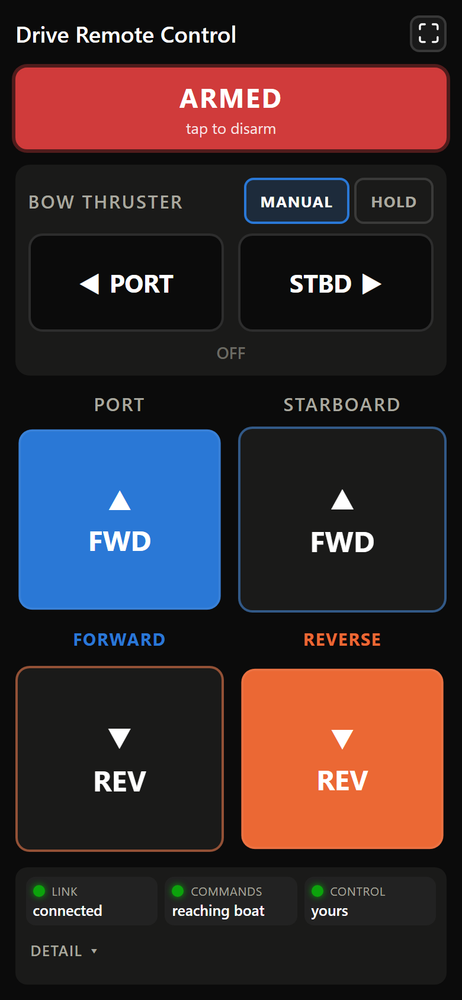
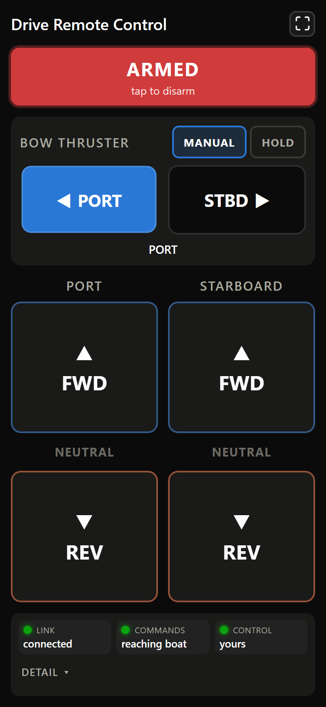
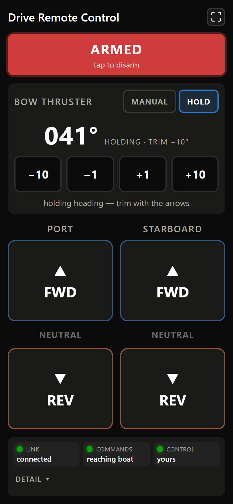

# signalk-drive-remote-controller

The **Plugin Controller** — the phone/tablet command station of the
[Drive Remote Controller](../README.md). A Signal K plugin with two halves: a
server-side arming authority that runs inside the Signal K server, and a
touch-friendly React 19 web app it serves.

It commands the same two machines as the handheld unit, under the same rules:
the **port and starboard drives** (momentary forward/neutral/reverse per side)
and the **bow thruster** (direct manual thrust, or trimming the held heading).
A latching kill switch arms both; releasing a control commands the safe value
immediately; and anything that makes a command untrustworthy — a dropped
connection, an interrupted touch, a unit that stops answering — falls back to
neutral and off rather than to the last thing anyone pressed.

See [ARCHITECTURE.md](../docs/ARCHITECTURE.md) for the whole system and
[SAFETY.md](../docs/SAFETY.md) for the invariants this plugin has to honour.

## Screenshots

| Fresh open — disarmed by default | Armed — two-handed drive manoeuvre |
|---|---|
| ![Phone view, freshly opened and disarmed: the kill switch reads DISARMED / tap to arm remote control; the bow thruster block sits above the drives with its MANUAL and HOLD chips both live and MANUAL selected by default, the PORT and STBD buttons greyed out, and the state line reading OFF · MANUAL selected — arm to thrust; both drives read NEUTRAL; and along the bottom three summary lamps read LINK connected, COMMANDS reaching boat, CONTROL none armed, above a collapsed DETAIL toggle. A full-screen toggle sits in the top-right of the header.](docs/screenshots/phone-disarmed.png) |  |

| Bow thruster — MANUAL | Bow thruster — HOLD |
|---|---|
|  |  |


*Opening the app always starts disarmed — arming is an explicit decision, and
the unit lamps confirm a board is actually answering before the ARM button will
do anything. The two-handed shot is the flagship case: port FORWARD and
starboard REVERSE held by different fingers at once, tracked per pointer. The
thruster pair shows its two modes.*

*The telemetry panel is **collapsed by default**, which is why most shots show
only three summary lamps and a DETAIL toggle: at the helm the drives should own
the screen, and opening the detail is a deliberate act by someone who has
stopped manoeuvring to read. The last three shots have it open, because the
rows inside it are their subject. The thruster-off one is the one worth
studying — with that board switched off the drives still arm and work, and the
missing unit is named on the kill switch itself (visible without opening
anything) as well as shown red in the detail. The last shows fixed precedence
made visible: TX qualifies, so this app's port presses do nothing, and the UI
says why instead of looking broken.*

Screenshots are captured from the **real built app** (`public/`) driving the
**real arming arbiter** (`arbiter.cjs`, over the same
`POST /plugins/<id>/intent` route production uses) behind a stand-in Signal K
server — the same substitution the test suite makes. The stand-in republishes
each unit's telemetry at its real cadence, because both the arm gate and the UI
judge a unit by *arrival*. Regenerate with:

```bash
npm run build
npm i --no-save playwright && npx playwright install chromium
node scripts/screenshots.cjs
```

Playwright is deliberately not a devDependency — it is ~120 MB of docs-only
tooling.

### The app icon

`static/` is a verbatim-copy directory (Vite's `publicDir`), so its contents
land in the built `public/` under **stable names** — which both the favicon
`<link>` and `signalk.appIcon` in `package.json` depend on. An imported asset
would be emitted with a content hash and break them on every rebuild.

| file | used by |
|---|---|
| `static/favicon.svg` | the browser tab |
| `static/icons/icon-192x192.png` | Signal K's Webapps list (`signalk.appIcon`), and `apple-touch-icon` |

Both are the same mark as the Android station's launcher icon — two opposed
chevrons, forward over reverse, in the project's `--forward` / `--reverse`.
The PNG is committed, so nothing needs running to build or install the plugin.
Regenerate it only if the mark changes:

```bash
node scripts/make-icon.cjs
```

That script rasterises the shapes itself (a point-in-polygon fill plus `zlib`)
rather than pulling in an image library for one flat-coloured icon. The
geometry exists in three places with no shared build step — the script, the
SVG, and the Android vector drawable — the same hand-synced arrangement as
`config.ts` / `config.h` / `SkContract.kt`. Change them together.

## Architecture

The browser app talks to the Signal K server's own `/signalk/v1/stream`
WebSocket — the same mechanism any device on the boat uses — but it **never
writes a Signal K path**. The server-side code (`index.cjs` plus the pure
`arbiter.cjs`) is the **single authority**: it arbitrates between every open UI
instance and is the sole writer of the `plugin.*` command paths. That is what
lets several phones and tablets be open at once without their armed states
fighting (see "One controller at a time" below).

```
Browser instance A ─┐  POST /plugins/<id>/intent   (its own intent + 250ms heartbeat)
Browser instance B ─┤  POST /plugins/<id>/intent   — NOT Signal K deltas, so no
                    │                                per-tab nodes in the data tree
                    ▼
  Signal K server ── plugin (index.cjs + arbiter.cjs): exclusive-arm / universal-disarm,
                    │      arm granted while at least one unit keeps answering
                    │      sole writer of:
                    │        plugin.enabled
                    │        plugin.port.command / plugin.stbd.command
                    │        plugin.thruster.command / .mode / .trimDeg
                    │        plugin.activeClient   ← every UI reads this to know who's armed
                    │        plugin.rxLive / .hhLive ← the arm gate's own verdicts
                    ▼
       RX (drives) and HH (bow thruster), each arbitrating its own sources:
       local > TX > this plugin
                    │
                    └──▶ telemetry (rx.* / hh.*) back up continuously — its ARRIVAL,
                         not its value, is what proves a unit is powered and on the
                         network

  Each UI's WebSocket is READ-ONLY: it subscribes to the rx.*, hh.* and plugin.*
  paths it displays, and never publishes a delta.
```

Intents travel over HTTP rather than as Signal K deltas so that per-tab plumbing
never enters the data model — a delta-based intent would leave a UUID-named node
per open browser tab sitting among the boat's data. The POST route is equally
secured: `signalk-server` wraps `/plugins/*` in its auth middleware, so an
unauthenticated request gets a 401 exactly as an unauthenticated delta write
would be dropped.

The route is registered at **`readwrite`**, not at the admin-only default that
a directly-registered plugin route would get. Commanding is a write, not an
administrative act, and the stricter default was in practice accidental: it
worked only because a browser opened from the admin UI carries an admin session
cookie (see "Authentication" below). It shut out every client authenticating
with a Signal K **access-request token** — the mechanism TX, RX and HH use, and
the one any non-browser station needs. See
[ARCHITECTURE.md §10](../docs/ARCHITECTURE.md) for the commissioning check that
confirms it on a given server.

## Building

```bash
npm install
npm run build      # tsc -b && vite build -> public/
```

`public/` is the servable output (gitignored, rebuild after any change — same convention as the firmware's `.pio/` build directory not being committed).

## Authentication (important on a secured server)

Publishing commands is a **write** to Signal K. If the server has security
enabled, it silently *drops* delta writes from an unauthenticated or
read-only connection — `socket.send()` still succeeds in the browser, so
without a check there'd be no sign the command never reached RX (verified
in signalk-server-node's `ws.ts`: an unauthorized update logs a
server-side provider error and returns, sending nothing back to the
client).

The app guards against that silent failure: on connect it queries the
server's own `/skServer/loginStatus` (same-origin, so it carries the same
session cookie the WebSocket does) and shows the result in the **Commands**
row of the status panel:

- **"reaching the boat"** — writes are allowed (security off, or you're
  logged in with write permission).
- **"BLOCKED — log in"** — the server requires authentication and this
  browser doesn't have it. Open the app from a browser that is logged into
  the Signal K admin UI (so the WebSocket inherits the session cookie), or
  the drive commands will not take effect.
- **"unconfirmed"** — couldn't reach `/skServer/loginStatus` (e.g. the
  `npm run dev` server, which isn't the SK server). Not an error, just not
  verified.

That check is only a proxy, made before a single command is sent. The lamp is
therefore **driven by the intent POSTs themselves as soon as one has been
answered** (`src/pure/intentStatus.ts`): a 2xx from the plugin's route reads
"reaching boat" whatever `loginStatus` said, a 401/403 reads "BLOCKED — log
in" (the route needs a higher permission level than this session has, or the
session has expired), a 503 reads "BLOCKED — plugin not running", and a
network failure or timeout reads "NOT REACHING BOAT". Each of those means a
STOP tap here would do nothing, so they are shown in the always-visible
summary row rather than behind the detail toggle.

Every row **below Connection** is derived from the last data the app
received, so whenever the socket isn't open (the Connection row reads
"Connecting…" or "Disconnected — reconnecting…") those rows are greyed out.
They keep their last-known text but are dimmed to signal "not live" — the
app never shows a confident green/yellow reading it can't currently confirm.
Only the Connection row itself stays fully coloured while offline, since it's
the one telling you the link is down.

## One controller at a time (enforced, not just advised)

Several phones/tablets can have this app open at once, but **only one can be
armed at a time — and that is now enforced server-side**, not left to
operator discipline.

Each open tab POSTs only its own *intent* to the plugin (a 250 ms heartbeat,
not a Signal K delta); the plugin (`index.cjs` + `arbiter.cjs`) decides who holds the
single **arm token** and publishes `plugin.activeClient`. Each UI shows ARMED
only when it *is* that holder. Concretely:

- **ARM is exclusive.** While one device holds the token, another device's
  kill switch shows **IN USE** and cannot arm.
- **DISARM is universal.** Any device's kill switch always works as a global
  **STOP** — it disarms whoever holds the token. Whoever is nearest the
  machinery can always stop it.
- **Take over** deliberately: on the *IN USE* device, tap once to STOP (disarm
  the other), then tap again to arm — passing through the safe disarmed state.
- **Fail-safe:** if the holder's tab closes or its WiFi drops, its heartbeat
  stops and the token auto-releases (→ disarmed, both drives NEUTRAL).

## Bow thruster: MANUAL and HOLD

The app also drives the **bow thruster** on the heading-hold unit, under the
same arm token as the drives, in one explicitly-selected mode:

- **MANUAL** — PORT/STBD buttons are the direction. Press and it thrusts;
  release and it stops, immediately. No minimum-on time, no anti-chatter, no
  deadband: a person is holding the button and watching the boat. The only
  delay is the thruster control box's own **measured ~1.75 s anti-reversal
  interlock** — flick straight from port to starboard and the box itself holds
  the motor off until it expires. The firmware adds no wait of its own in
  MANUAL (its manual dwell ships at 0 — SAFETY.md thruster invariant 7), so the
  coast you see is the box's, and the app's "reversing — waiting for the
  thruster" note only appears if that firmware dwell is ever raised.
- **HOLD** — the unit holds the heading it captured when hold engaged, and the
  ±1° / ±10° buttons **trim** it. This app owns a **relative trim offset**
  (0 = no trim) and publishes it as a level rather than sending "+1°" events: an
  event has to arrive exactly once to stay correct, while a level is
  self-correcting over a lossy link and survives a reboot. Relative means it
  needs no seed (a press is always well-defined) and no "not commanding"
  sentinel (0 says it); it is clamped to ±45° and the unit slews toward
  `captured heading + trim` at a bounded rate. The app opens in MANUAL — trim is
  an after-arming action, so the trim resets to 0 whenever the thruster is not
  commandable and arming never swings the boat to a pre-dialled offset.

**Pick the mode before you arm.** The MANUAL/HOLD chooser stays live while
disarmed — it commands nothing, it only decides which gate the *next* arm opens,
and choosing it afterwards would mean arming into whichever mode happened to be
showing. Everything that actually reaches the thruster (the PORT/STBD buttons,
the trim steps) stays greyed and inert until this app holds the token, the
socket is up and the heading-hold unit is answering. One consequence is stated
on the widget rather than left to be discovered: **with HOLD selected, arming
alone starts the hold** — the unit captures the heading and works the thruster
with no further press. Disarmed, the panel says so, and it labels the big number
"current heading" instead of "holding", because nothing is being held yet.

Authority is the same rule as the drives: the unit's own engage switch wins
unconditionally, then TX, then this app — and the app says "controlled by TX
remote" when a press here is being outranked.

## No arming without a live unit

**You cannot arm unless at least one unit is powered and reachable**, and if
both go away while armed, the arm is released automatically. Arming is
edge-triggered, so a returning unit never silently re-arms anything — it takes
a fresh tap. Stopping is never blocked by this: DISARM works in every state.

One arm covers both machines, and a single missing unit does **not** block it —
it is *named* instead (on the ARM button and as its own lamp). Refusing to arm
the drives because the thruster board happens to be switched off would take away
the primary docking control at the worst possible moment; the drives are what
you need at the dock, and the thruster board is the likelier of the two to be
off. Per-machine gating still applies, so arming with one unit present never
lights up controls for the absent one.

Each machine's command widget is **greyed out and made inert** whenever a press
there could not reach it — this app is disarmed, the socket is down, or that
machine's own unit isn't answering. A control that cannot move its machine must
not look like it can, so the drive buttons go dark and unpressable when the RX
(drive) board is gone, and the whole bow-thruster block does the same when the
HH (thruster) board is gone, each independently of the other. This is not the
stop path: the kill switch stays fully live in every one of those states (its
disarm travels over HTTP and is never gated), so greying the command widgets
takes nothing away from your ability to stop the machinery — it only removes the
misleading affordance of a button that would do nothing. If a press is already
held when authority is withdrawn, the button force-releases to the safe value,
exactly as a lost touch would.

The condition is that a unit's telemetry is still **arriving** (each republishes
it every 250 ms; unseen for 1.5 s ⇒ gone). It is deliberately *not* the value of
`rx.linkUp` or `rx.linkOk`:

- `rx.linkUp` is published *by* RX, and Signal K keeps a path's last value
  forever — so a switched-off RX leaves it reading `true` indefinitely. This
  was a real reported bug: the phone showed an all-green panel and would arm
  for a board that had no power.
- `rx.linkOk` means "a remote source is live **and** enabled" — a consequence
  of something already being armed. Gating arming on it would deadlock.

The app shows this as **Drive unit** and **Thruster unit** lamps (responding /
NOT RESPONDING / NOT SEEN). When a unit isn't answering, its readings grey out
rather than presenting a last-known value as if it were live, and when neither
is, the ARM button is withdrawn with the reason shown on it.

The status display is a grid of **traffic-light lamps** — a coloured lamp, a
small fixed title, and the current reading — rather than the original list of
full-width prose rows. The colour is readable at a glance and in peripheral
vision while you are looking at the boat instead of the screen, and it keeps the
controls on screen on a phone. The greying rule above is unchanged and still the
point: an unlit, dimmed lamp means "was, not is."

`plugin.hhLive` is the thruster unit's counterpart to `plugin.rxLive` — the
server's own continuously-recomputed verdict, published so every UI enforces
exactly the gate the server applies.

## Installing into a Signal K server

Copy or symlink this directory into the server's plugin directory (typically `~/.signalk/node_modules/signalk-drive-remote-controller`), then restart the server. It appears in the SK admin UI's plugin list as "Drive Remote Control" (disabled by default — a safety-relevant remote control shouldn't come pre-armed just because it was installed) and, once enabled, its webapp is reachable from the server's webapps list at `/signalk-drive-remote-controller/`.

## Development

```bash
npm run dev         # Vite dev server with hot reload
npm test            # vitest run -- all unit + integration + end-to-end tests
npm run test:watch  # vitest watch mode
```

`npm run dev` serves the app on its own port, not through the Signal K server — point it at a real server by opening it from a browser on the same machine as (or with network access to) the SK server, since it connects to `window.location.host`'s `/signalk/v1/stream`. For real development against a live server, building and reinstalling (or symlinking `public/` to a dev build) is more representative than the dev server, since the dev server's own origin isn't the SK server.

## Safety parity with TX

| TX (firmware) | This app | Why the same |
|---|---|---|
| Momentary, spring-return shift switches; release = NEUTRAL, no latch | Momentary touch buttons (Pointer Events); release/cancel/tab-hidden/blur = NEUTRAL, no latch | A drive remote pulses in and out of gear; it doesn't stay in gear because a button was held down a moment ago. |
| `FromSwitch(forward, reverse)`: both contacts active → NEUTRAL, never a direction | `fromSwitch()` (`src/pure/driveCommand.ts`) — a direct port, same truth table | Two independent touch buttons make "both pressed" reachable in a way one physical switch can't; the fail-safe answer must be identical either way. |
| Enable/kill switch: latching toggle, gates whether RX honors this source | Kill switch: latching toggle, defaults OFF on load | No physical switch position to read on page load, so the safe default is chosen deliberately. |
| Publish on change + every 250 ms (`config::kSkPeriodicRefreshMs`) | POST an intent on change (immediately, no polling delay) + every 250 ms (`PERIODIC_REFRESH_MS`); the plugin server republishes to Signal K | Keeps RX's per-source liveness watchdog fed during a steady press, and the arbiter's view of which UIs are still alive; this app is event-driven so its *on-change* path is actually faster than TX's 20 ms-sampled GPIO reads. |
| SensESP's WiFi/SK client handles reconnects | `skClient.ts` reconnects with capped exponential backoff | Same intent, different platform. |
| No local override authority (TX only publishes) | Same — this app has no authority over a unit's own local controls, and is outranked by TX by fixed precedence | Matches the project's station-in-command model exactly; see the status panel's "controlled by" display when TX has priority. |
| Two thruster buttons + a MANUAL/HOLD switch | Two thruster buttons + a MANUAL/HOLD toggle, and ±1°/±10° trim in HOLD | Same two modes, same fail-safe release; the phone gets discrete trim buttons because press-and-hold repeat suits a panel switch, not glass. |

One deliberate **non**-parity: TX's shift and thruster switches are always
physically there to move, so TX shows its true switch position at all times. A
glass button has no true position to show — a pressable-looking button that
commands nothing is just misleading — so this app instead **greys out and
disables** each machine's command widget whenever it can't command (disarmed,
offline, or that unit not answering; see "greyed out and made inert" above). The
kill switch is the one control held to full parity with TX's latching enable: it
never greys and its disarm is never gated, because stopping must always work.

## Testing strategy

- `test/arbiter.test.ts` — the **server-side arming arbiter** (`arbiter.cjs`): exclusive arm, universal disarm, edge-not-level re-arm, staleness auto-release, two-tap handoff, command forwarding, the bow-thruster command fields, and the two-unit arm gate. The safety-critical core, exhaustively vectored like the firmware's `test_arbitration.cpp`.
- `src/pure/driveCommand.test.ts` — the pure command-mapping logic, mirroring `test_drive_command.cpp`'s coverage.
- `src/pure/writeAccess.test.ts` — the pure mapping from the server's `/skServer/loginStatus` answer to whether commands can actually be published (the secured-server silent-drop guard above).
- `src/pure/sources.test.ts` — the pure RX-source parsing/labelling used by the "controlled by …" per-drive note and the multi-controller warning.
- `src/hooks/useMomentaryButton.test.tsx` — per-button press/release/cancel/multi-pointer/tab-hidden/blur behavior in isolation.
- `src/skClient.test.ts` — the WebSocket wire protocol (subscribe scoping, the read-only guarantee that no `updates` message is ever sent, reconnect) against a **real** `ws` server, not a mock.
- `src/App.test.tsx` — component-level interaction tests (arm/disarm via the real arbiter, IN-USE lockout, two-tap takeover, single presses, true simultaneous multi-touch across different buttons) against a real `ws` server running the real arbiter.
- `test/endToEnd.test.tsx` — one continuous, realistic operator session (connect → arm → two-handed maneuver → background-interrupt fail-safe → reconnect → disarm) chaining the above into a single narrative, catching anything that only shows up when the pieces run together over time.
- `test/pluginRoute.test.ts` — how `index.cjs` **registers** `/intent` with the server: at `readwrite` through the access-scoped registrar, never as an admin-only duplicate, with the documented fallback on a server that lacks `router.access`. A security-posture test rather than a plumbing one — the level is the difference between a token-authenticated station working and being rejected, and it is invisible to every test that only drives the handler.
- `test/arbiterServer.ts` — not a test itself: the shared harness that runs the real `arbiter.cjs` behind the stand-in `ws` server, so the UI tests exercise the true `intent → arbitrate → activeClient echo → UI` loop rather than a mocked arming decision.

No layer here is mocked out from the one below it except the actual Signal K *server* itself, which is stood in for by a real, unmodified `ws` WebSocket server (running the real arbiter) speaking the same delta protocol.
